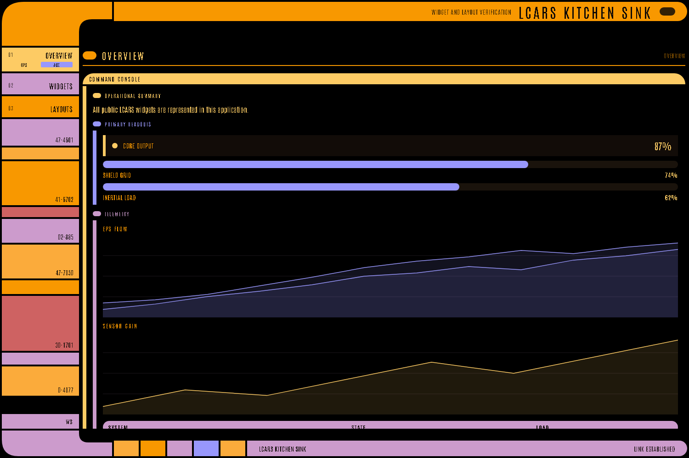
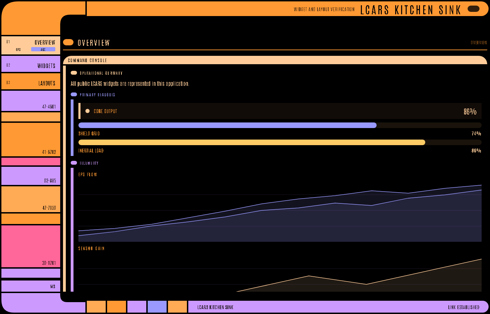
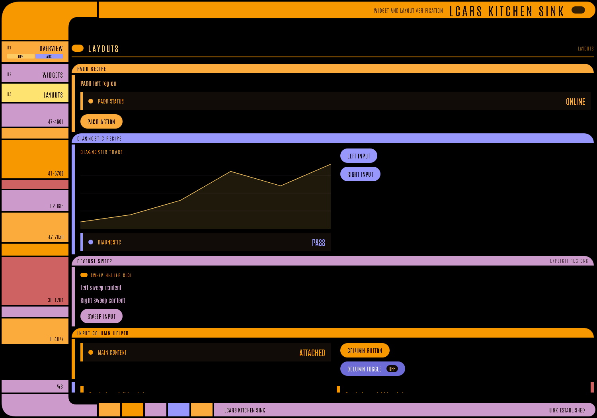

# LCARS WebUI

Turn a Python script into a live, Star Trek-style **LCARS** dashboard — no web development experience required.

```python
import lcars_ui as lcars

def ui():
    lcars.config("Bridge Operations", subtitle="NCC-1701-D")
    with lcars.page("Main View", layout="console"):
        with lcars.data_panel("Telemetry"):
            lcars.chart([82, 84, 87, 91, 95], title="Warp Field")
            lcars.metric("Shields", "100%", status="ok")
        with lcars.control_panel("Actions"):
            if lcars.button("Red Alert", color="red"):
                lcars.set_alert_condition("red")

if __name__ == "__main__":
    lcars.run(ui)
```

You write Python; the library builds a versioned JSON manifest, serves it over FastAPI + WebSocket, and renders it in the browser with a bundled React frontend. Every click reruns your function so it can react.

## Adaptive layout

You declare panels — the renderer composes them into an **authentic, viewport-filling LCARS console**, not a scrolling page. An intelligent layout engine picks a *layout archetype* and places each panel into a zone:

- **`console`** — primary data lane + side readouts + control dock (the everyday dashboard)
- **`telemetry`** — one dominant data scope + a readout rail
- **`grid`** — a periodic-table-style wall of equal cells
- **`menu`** — a sparse selection screen with generous negative space

Pin one with `lcars.page("Ops", layout="telemetry")`, or leave it `auto` and the engine chooses by content. Override any single panel with `zone="primary" | "side" | "dock"`. The console fills the screen — overflow lives inside a panel, never the whole page.

## Screenshots

LCARS WebUI ships with switchable themes (`galaxy`, `nemesis`, `tng`) and an authentic LCARS bracket shell — elbows, nav rail, and footer — driven entirely by your widget tree.

| Galaxy theme | Nemesis theme |
| --- | --- |
|  |  |

| TNG theme | Layout recipes (PADD, sweep, columns) |
| --- | --- |
|  |  |

## What's included (v3.5)

- **24 widget types** across inputs, display, data, charts, media, and containers.
- **v3 chart widgets**: zoomable candlestick/Renko charts with trade markers (TradingView `lightweight-charts`) and animated WebGL shader viewports.
- **Adaptive archetype layout**: the engine places panels into zones automatically; explicit `zone=` overrides always win.
- **Live WebSocket streaming**: `@lcars.live(interval=N)` pushes real-time updates from a background loop — no polling.
- **Three themes**: `galaxy` (TNG/DS9), `tng` (season 1–2), `nemesis` (First Contact).
- **228 backend tests** + **32 frontend tests** green; ruff + mypy clean; golden contract enforced.

## Quick start

```bash
cd lcars-ui
python -m venv .venv && source .venv/bin/activate
pip install -e ".[dev]"
python examples/bridge_ops/app.py      # opens http://127.0.0.1:8000
```

→ Full install guide and API reference: **[lcars-ui/README.md](lcars-ui/README.md)**

→ Tutorials, recipes, and widget reference: **[GitHub Wiki](https://github.com/darsrc/LCARS-WebUI/wiki)**

## Design law — read before touching visuals

LCARS is a composition language, not a color scheme. Two specs define it, and they win over taste:

- **[LCARS_PORTING_SPEC.md](LCARS_PORTING_SPEC.md)** — semantic source of truth
- **[STRICT_LCARS_VISUAL_SPEC.md](STRICT_LCARS_VISUAL_SPEC.md)** — visual law, defined at screenshot-level pass/fail
- **`LCARS_TRUTH/`** — canonical Star Trek LCARS reference frames to measure renders against

## Repository layout

```text
LCARS-WebUI/
├── README.md                     # this file
├── LCARS_PORTING_SPEC.md         # semantic source of truth
├── STRICT_LCARS_VISUAL_SPEC.md   # strict-mode visual law
├── LCARS_TRUTH/                  # canonical LCARS reference frames
├── wiki/                         # GitHub Wiki source (mirrored to the wiki tab)
└── lcars-ui/                     # the package
    ├── README.md                 # install, quickstart, full reference
    ├── src/lcars_ui/             # Python library (DSL, server, contract)
    ├── frontend/                 # React/TypeScript renderer (bundled into the package)
    ├── tests/                    # backend tests
    ├── examples/                 # runnable example dashboards
    └── docs/                     # user reference (quickstart, DSL, widgets, deployment)
```

## Contributing & policies

[CONTRIBUTING.md](CONTRIBUTING.md) · [AGENTS.md](AGENTS.md) (parity guardrails) · [SECURITY.md](SECURITY.md)
