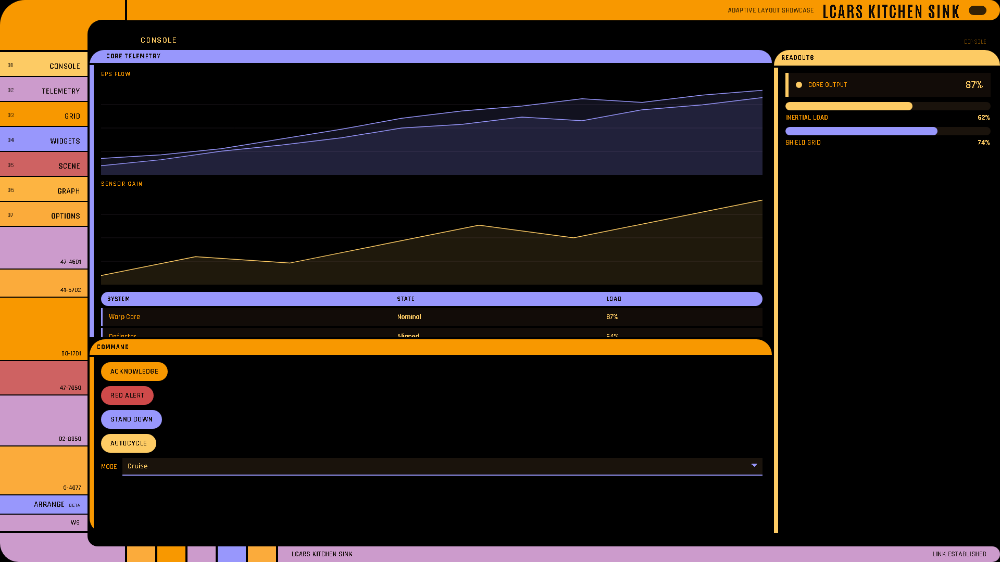
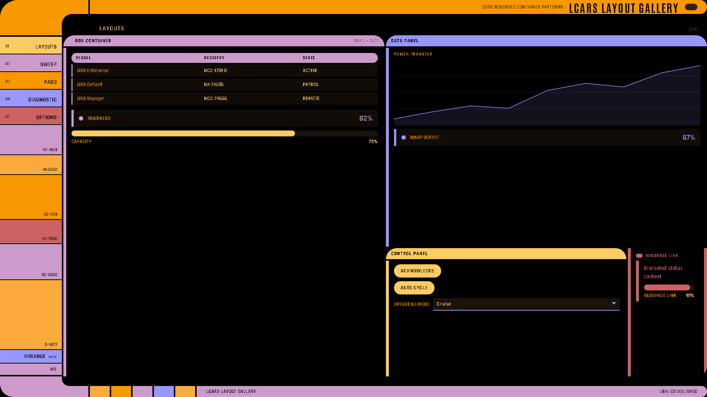

*AI assists as a tool under my direction — I set the vision, make the calls, and stand behind everything it helps me build.*

# LCARS WebUI

LCARS WebUI 7.1.0 is a Python 3.10+ library for building live, browser-rendered
LCARS applications without writing application HTML, CSS, or JavaScript. Python
declares the interface, Pydantic models define a versioned manifest, FastAPI serves it,
and a bundled React frontend renders code-native LCARS geometry.

v7 uses a declarative application lifecycle: an `App` owns pages, actions, live jobs,
configuration, services, testing, and serving. Pages declare widgets once; browser
interactions call explicit handlers. There is no rerun.

## A minimal application

```python
from lcars_ui import ActionContext, App, ui

app = App()
app.config("Bridge Ops", subtitle="NCC-1701-D", theme="galaxy", settings_page=False)


@app.page("Overview", id="overview", layout="console")
def overview() -> None:
    with ui.data_panel("Telemetry", id="telemetry"):
        ui.metric("Shields", "100%", status="ok", id="shields")

    with ui.control_panel("Commands", id="commands"):
        ui.button("Red Alert", color="red", id="red-alert")


@app.action("red-alert")
def red_alert(ctx: ActionContext[None]) -> None:
    ctx.update("shields", value="Alert", status="crit")
    ctx.set_alert_condition("red")
    ctx.notify("Battle stations", level="error")


if __name__ == "__main__":
    app.serve(port=8077, open_browser=True)
```

`@app.page(...)` functions run during manifest construction, not after every click.
`ui.button(...)` declares a button; it does not return a click flag. The matching
`@app.action(...)` handler runs once per action, and effects are methods on its typed
`ActionContext`.

Ordinary application building blocks live in `lcars_ui.ui` (33 public names).
Specialist composition, Surface Engine, graph workspace, and media functions live in
`lcars_ui.advanced` (27 public names). The nine bundled themes are `galaxy`, `nemesis`,
`tng`, `outpost`, `cardassian`, `klingon`, `romulan`, `ferengi`, and `gruvbox`.

## Get started

From a clone:

```bash
git clone https://github.com/darsrc/LCARS-WebUI.git
cd LCARS-WebUI/lcars-ui
python -m venv .venv
source .venv/bin/activate
pip install -e ".[dev]"
python examples/bridge_ops/app.py
python examples/bridge_ops/app.py --port 8011 --ip 0.0.0.0
```

The example serves at `http://127.0.0.1:8077/` by default. Direct app scripts
accept `--port` and `--ip` (`--host` is an alias), so the second command listens
on port 8011 on every interface without editing the application.

The installed CLI can also create a complete two-page project with an action handler
and a passing test:

```bash
lcars new bridge-ops --dir ..
cd ../bridge-ops
pip install -e '.[dev]'
pytest -q
lcars dev
```

Use `lcars check` to build and validate an application without binding a port. Use
`lcars migrate PATH` to find v6 rerun patterns before porting an older application.

## Documentation

- **[Package README](lcars-ui/README.md)** — features, runtime behavior, examples, and
  development commands.
- **[Quickstart](lcars-ui/docs/quickstart.md)** — the application model, testing, forms,
  and themes.
- **[Widget reference](lcars-ui/docs/widgets.md)** — every `ui` and `advanced` widget
  family and its action payload.
- **[Layout and DSL reference](lcars-ui/docs/dsl.md)** — pages, composition, state,
  effects, services, and sessions.
- **[Migration guide](lcars-ui/docs/migration.md)** — the v6-to-v7 control-flow change
  and `lcars migrate`.
- **[Deployment guide](lcars-ui/docs/deployment.md)** — authentication, limits,
  session affinity, proxies, and uploads.
- **[GitHub Wiki](https://github.com/darsrc/LCARS-WebUI/wiki)** — tutorials, recipes,
  troubleshooting, and the visual gallery.

For coding agents and documentation tools, **[llms.txt](llms.txt)** is the compact
curated index and **[llms-full.txt](llms-full.txt)** is the generated one-file corpus.

## What it includes

- Adaptive `auto`, `console`, `telemetry`, `grid`, and `menu` layouts, plus authored
  composition and arbitrary-topology Surface Engine screens.
- LCARS-native panels, controls, forms, tables, charts, logs, hints, notifications,
  uploads, HLS video, shaders, managed Three.js scenes, and node graphs.
- Session-private action effects, reconnect hydration, live updates, WebSocket transport
  with SSE/HTTP fallbacks, typed services, and an in-process application test client.
- Typed, application-defined keyboard bindings with framework-default overrides and
  browser-local remapping from the built-in Options page.
- Scoped token authentication, CORS controls, secure headers, rate limits, and bounded
  request bodies for internet-facing deployments.

Every application surface is code-rendered from its widget tree. Reference screenshots
are measurement and validation inputs only; they are never embedded into parity UI.

| Galaxy theme | Authored LCARS layouts |
| --- | --- |
|  |  |

## Develop and verify

Run from `lcars-ui/`:

```bash
make ci
```

Focused commands include `pytest tests/`, `make lint`, `make contracts-check`,
`cd frontend && npx vitest run`, and `make frontend-bundle`. Backend source must remain
compatible with Python 3.10.

## Design law and policies

LCARS is a composition language, not a color scheme. These sources are authoritative
for visual and canon-parity work:

- **[LCARS_PORTING_SPEC.md](LCARS_PORTING_SPEC.md)** — semantic porting law.
- **[STRICT_LCARS_VISUAL_SPEC.md](STRICT_LCARS_VISUAL_SPEC.md)** — screenshot-level
  visual requirements.
- **`LCARS_TRUTH/`** — local reference frames for measurement and validation only.

See [AGENTS.md](AGENTS.md) for the non-negotiable raster-embedding guardrails,
[CONTRIBUTING.md](CONTRIBUTING.md) for contribution checks, and
[SECURITY.md](SECURITY.md) for private vulnerability reporting.
