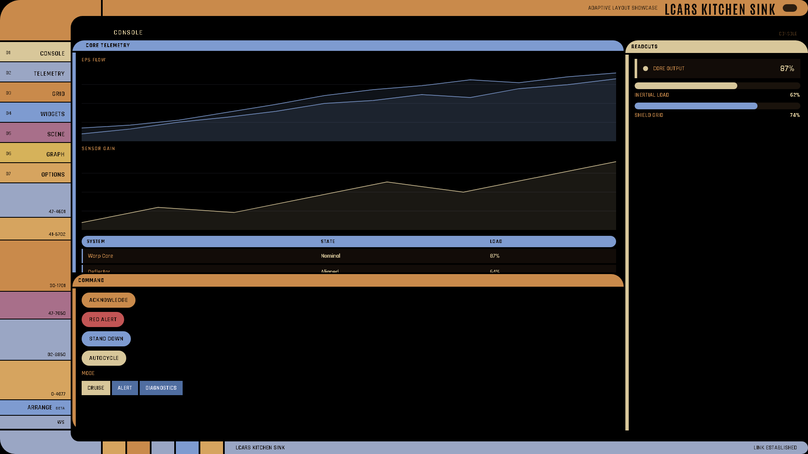
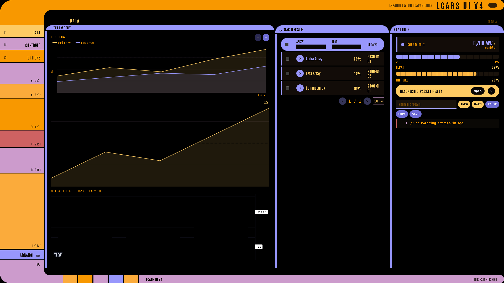
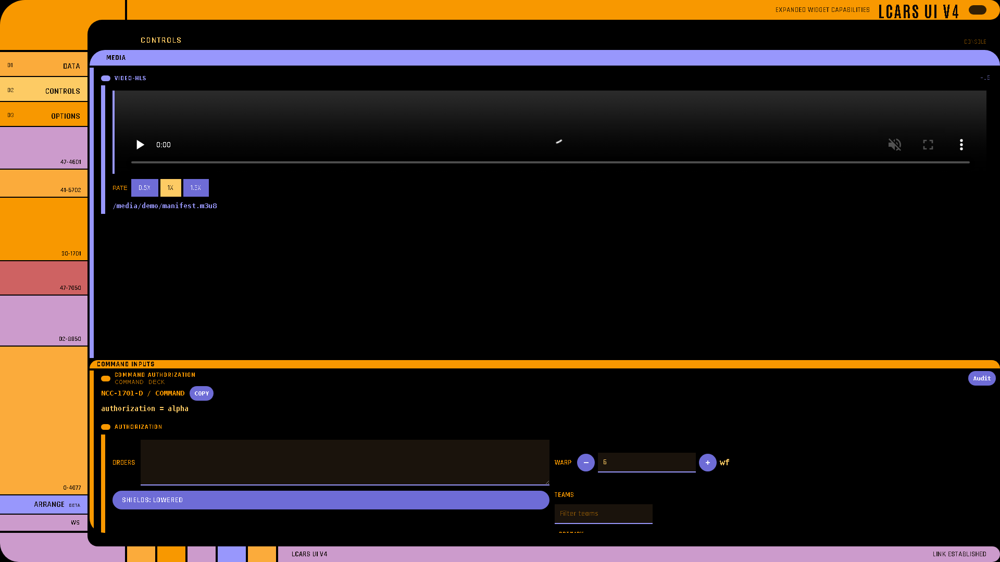
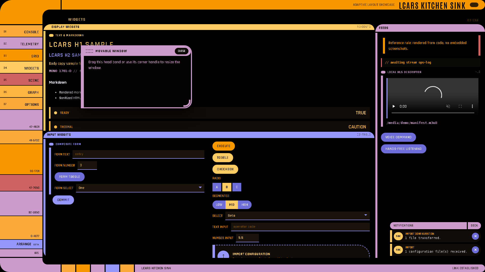
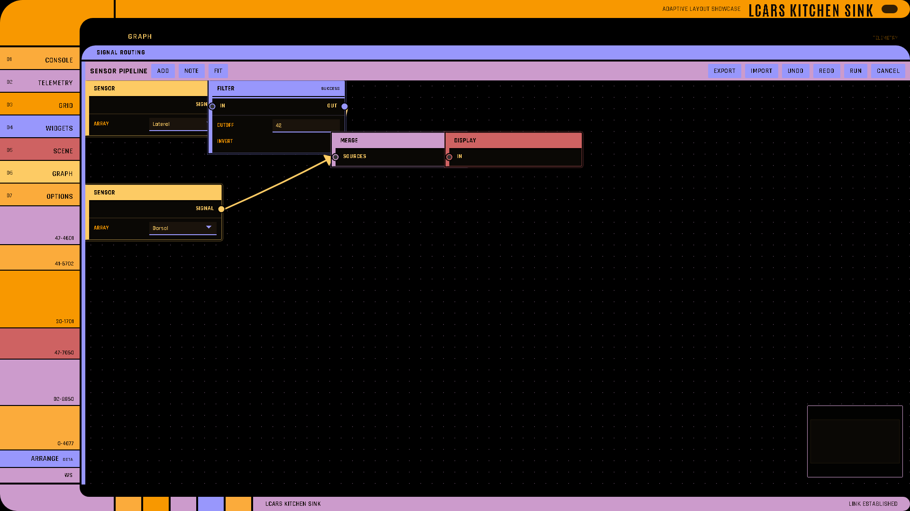

# LCARS WebUI

Build live, Star Trek-style **LCARS** applications in Python—without writing HTML,
CSS, or JavaScript.

```python
import lcars_ui as lcars


def ui() -> None:
    lcars.config("Bridge Operations", subtitle="NCC-1701-D")
    lcars.nav("Main View", page="main")

    with lcars.page("Main View", id="main", layout="console"):
        with lcars.data_panel("Telemetry"):
            lcars.chart([82, 84, 87, 91, 95], title="Warp Field")
            lcars.metric("Shields", "100%", status="ok", id="shields")

        with lcars.control_panel("Actions"):
            if lcars.button("Red Alert", color="red", id="red-alert"):
                lcars.set_alert_condition("red")
                lcars.notify("Battle stations", level="error")


if __name__ == "__main__":
    lcars.run(ui)
```

LCARS WebUI turns that function into a versioned JSON manifest, serves it with
FastAPI, and renders it through a bundled React frontend. Browser actions rerun the
Python function with per-session input state; live tasks push targeted updates over a
persistent WebSocket.

## Current release: 4.5.0

The library now covers full operational dashboards, interactive data tools, immersive
views, and native knowledge-client instruments for **The Web v0.3/v0.3.1**.

- **Adaptive LCARS composition** with `console`, `telemetry`, `grid`, `menu`, or
  content-driven `auto` page layouts.
- **LCARS-native containers** including panels, consoles, PADDs, diagnostics, sweeps,
  brackets, pop-up windows, and rich floating hints.
- **Displays and visualizations** including metrics, meters, tables, logs, line and
  financial charts, HLS video, WebGL shaders, managed Three.js scenes, and an editable
  node canvas.
- **Inputs and effects** including forms, drag-and-drop file upload, microphone input,
  notifications, alert-condition changes, theme switching, and direct widget updates.
- **Typed v4 capabilities** for sorting, filtering, pagination, selection, validation,
  interaction state, collapsible containers, accessibility, and reduced motion.
- **The Web instruments**: support environments, one-hop frontier traversal, assertion
  and anchor cards, tri-state results, constraint bands, gap panels, and commitment
  selection.
- **Three switchable themes**: `galaxy`, `tng`, and `nemesis`, plus a browser-local
  Options page enabled by default.
- **Production transport and hardening**: WebSocket with SSE/HTTP fallbacks, scoped
  bearer-token auth, CORS controls, secure headers, rate limits, and bounded uploads.

## Screenshots

Every application surface is code-rendered from the widget tree. No target screenshot
or raster backdrop is embedded in the UI.

| Galaxy theme | Nemesis theme |
| --- | --- |
|  |  |

| TNG theme | Layout recipes |
| --- | --- |
|  |  |

### Current interactive surfaces

These captures come from running examples at 1920×1080. The gallery includes active
overlays and lazy content so the documented states match the current codebase.

| Typed data capabilities | Typed controls |
| --- | --- |
|  |  |

| Rich hints and notifications | Pop-ups and file upload |
| --- | --- |
|  |  |

| Managed Three.js scene | Editable node canvas |
| --- | --- |
|  |  |


Regenerate this gallery from the bundled examples with `make docs-screenshots` in
`lcars-ui/`. The capture recipe and browser overrides are documented in
[docs/screenshots/README.md](docs/screenshots/README.md).

## Adaptive layout

Declare panels and let the renderer tessellate them into a viewport-filling LCARS deck:

| Archetype | Best fit |
| --- | --- |
| `console` | Primary instruments, side readouts, and a control dock. |
| `telemetry` | One dominant visualization with a narrow readout rail. |
| `grid` | Repeated subsystem cells. |
| `menu` | Sparse navigation, settings, and detail views. |
| `auto` | Chooses an archetype from the page's content. |

Use `zone="primary"`, `"side"`, `"dock"`, or `"full"` to override placement. More
specific composition hints—`span`, `weight`, `aspect`, `group`, and `sizing`—are
available when the automatic mosaic needs direction. Viewers can also use Arrange mode
to create a browser-local layout without changing the Python manifest.

## Quick start

**Requirements:** Python 3.10+. Node.js is needed only when changing the frontend.

```bash
git clone https://github.com/darsrc/LCARS-WebUI.git
cd LCARS-WebUI/lcars-ui
python -m venv .venv
source .venv/bin/activate
pip install -e ".[dev]"
python examples/bridge_ops/app.py
```

The app opens at `http://127.0.0.1:8000/`.

Useful examples:

| Example | Demonstrates |
| --- | --- |
| `examples/bridge_ops/app.py` | A focused operational dashboard. |
| `examples/kitchen_sink/app.py` | The broad widget and layout showcase. |
| `examples/widget_capabilities/app.py` | Typed v4 options and server interaction state. |
| `examples/table_repositories/app.py` | Enhanced tables and lazy expanded content. |
| `examples/vibe_coder/app.py` | AI development console with task tracking and live logs. |
| `examples/algo_trading/app.py` | Candlestick and Renko financial views. |

For the complete install and authoring reference, see
**[lcars-ui/README.md](lcars-ui/README.md)**. Tutorials, recipes, deployment guidance,
and troubleshooting live in the **[GitHub Wiki](https://github.com/darsrc/LCARS-WebUI/wiki)**.

## Runtime model

```text
Python ui() -> typed manifest -> FastAPI -> React LCARS renderer
     ^                              |
     +------ action / input --------+

@lcars.live -> widget/log events -> WebSocket -> targeted browser patch
```

- **BUILD:** startup executes `ui()` to create the manifest.
- **HANDLE:** an action reruns `ui()`; inputs return that session's current values and
  the triggering button returns `True`.
- **LIVE:** one optional `@lcars.live(interval=...)` callback broadcasts direct updates
  independently of user actions.

The same Pydantic models generate the runtime schema, TypeScript contract, and validator.

## Develop and verify

Run from `lcars-ui/`:

```bash
pytest tests/
cd frontend && npx vitest run
cd .. && make lint
make contracts-check
make frontend-bundle
make docs-screenshots
```

`make ci` runs the project gate. `make security-audit` checks dependency and application
security. When a widget contract changes, use `make contracts-update` and commit every
generated artifact.

## Design law

LCARS is a composition language, not a color scheme. These sources are authoritative:

- **[LCARS_PORTING_SPEC.md](LCARS_PORTING_SPEC.md)** — semantic source of truth.
- **[STRICT_LCARS_VISUAL_SPEC.md](STRICT_LCARS_VISUAL_SPEC.md)** — screenshot-level
  visual requirements.
- **`LCARS_TRUTH/`** — reference frames for measurement and validation only.

Parity UI must be code-rendered. Reference screenshots and derivatives may never be
embedded as backgrounds, masks, canvas images, data URLs, or other raster shortcuts.

## Repository map

```text
LCARS-WebUI/
├── LCARS_PORTING_SPEC.md
├── STRICT_LCARS_VISUAL_SPEC.md
├── LCARS_TRUTH/
├── wiki/                         # source mirrored to the GitHub Wiki repository
└── lcars-ui/
    ├── src/lcars_ui/             # DSL, models, server, and bundled assets
    ├── frontend/                 # React/TypeScript renderer
    ├── examples/                 # runnable applications
    ├── tests/                    # backend, contract, and visual coverage
    └── docs/                     # package-level guides and release notes
```

## Contributing and policies

[Contributing](CONTRIBUTING.md) · [Parity guardrails](AGENTS.md) ·
[Security policy](SECURITY.md) · [4.5.0 release notes](lcars-ui/docs/release-v4.5.0.md)
