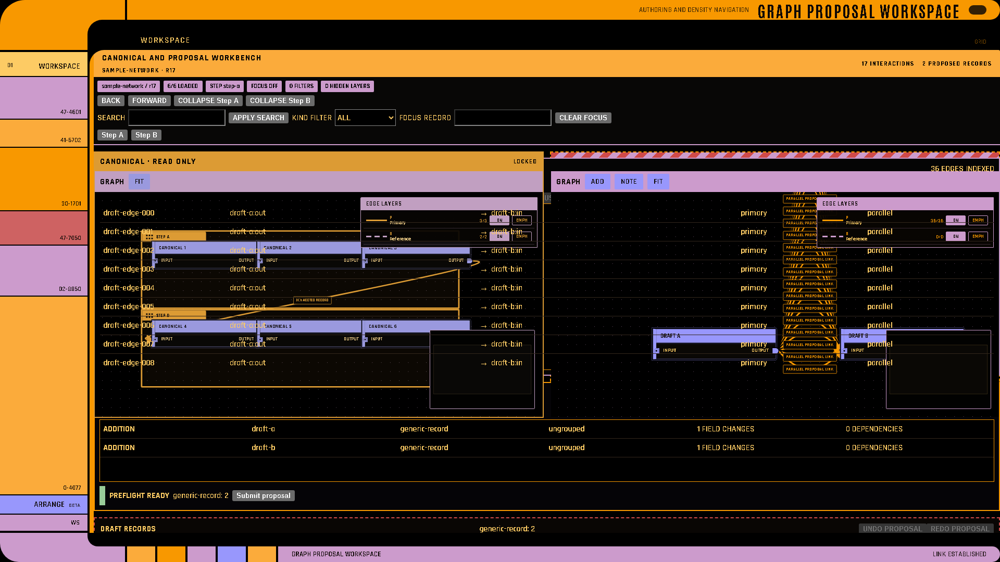
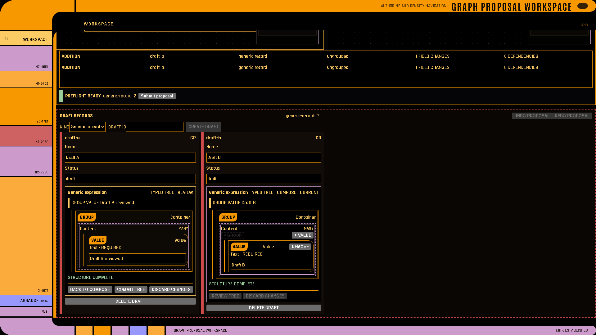

# Graph Workspace

LCARS-WebUI 5.0 adds a generic authoring workbench for graph applications that must
keep canonical content immutable while users compose a proposal.

| Canonical and proposal planes | Proposal authoring and diff |
| --- | --- |
|  |  |

Run the complete generic example:

```bash
cd lcars-ui
python examples/graph_workspace/app.py
```

## Plane ownership

`GraphWorkspaceDocument` has four deliberately separate concerns:

| State | Owner | Mutability |
| --- | --- | --- |
| `canonical` | Server/caller | Loaded revision is read-only. |
| `proposal` | Author | Draft records, typed values, and graph edits only. |
| `reader` | Viewer | Pan, zoom, visibility, collapse, focus, filter, search, history. |
| `receipt` | Ingestion service | Submission outcome; canonical styling waits for a fresh read. |

The widget never mutates a canonical record in place. Replacement and retirement are
proposal operations that refer back to the base revision.

## Minimal contract

```python
revision = lcars.GraphRevision(graph_id="network", revision="r17")

workspace = lcars.GraphWorkspaceDocument(
    format="lcars-graph-workspace",
    version=1,
    workspace_id="workbench",
    canonical=lcars.CanonicalPlane(
        graph=revision,
        records=canonical_records,
        projection=canonical_projection,
    ),
    proposal=lcars.ProposalPlane(
        proposal_id="draft-1",
        title="Draft",
        base=revision,
        changes=[],
        projection=proposal_projection,
    ),
    record_schemas=record_schemas,
    tree_schemas=tree_schemas,
    validation_rules=validation_rules,
    actions=submission_actions,
)

state = lcars.graph_workspace(
    workspace,
    title="Proposal workbench",
    options=lcars.GraphWorkspaceOptions(
        fan_page_size=20,
        virtual_row_height=36,
        autosave_key="proposal-draft-1",
        interaction=lcars.InteractionOptions(mode="server", action_id="workspace"),
    ),
)
```

All workspace models shown here are exported directly from `lcars_ui`.

## Caller-supplied grammar

The library knows that schemas and rules exist, but not what they mean.

- `WorkspaceRecordSchema` declares generic kinds, appearance keys, scalar/reference/tree
  fields, and searchable field paths.
- `WorkspaceTreeSchema` declares typed parts, slots, cardinality, compatible child parts,
  and code-rendered geometry keys. Incompatible parts remain visible but disabled.
- `WorkspaceValidationRule` supports generic structural checks and server-owned custom
  validation. Domain semantics stay in the application.
- `WorkspaceAction` declares reader, proposal, or submission commands and their transport.

No application node type, field name, layer, or semantic rule is built into NodeCanvas.

## Transactions and autosave

Creating or deleting a draft, committing a field, changing a typed tree, moving a draft
node, or connecting a proposal edge creates one proposal transaction. Undo/redo is
bounded to that proposal history. Reader operations do not enter it. When `autosave_key`
is set, a proposal checkpoint is stored in browser-local storage after the configured
delay and restored only when its workspace/base identity remains compatible.

## Interaction counting

One interaction is one intentional committed proposal command or one committed
field/group edit.

- A compound command counts once even when it changes several records.
- Accepting a semantic suggestion counts as one committed semantic choice.
- Keystrokes, pointer movement, DOM/React/React Flow/transport events, intermediate
  edits, reader commands, and passive previews count zero.

The reusable counter and harness follow that definition. An application's acceptance
walkthrough belongs in that application because only it knows the intended authoring
task and semantic decisions.

## Density navigation

The reader state supports collapse/expand with restoration, directed 1–5 hop focus,
facet filters, search with matched-field labels, per-step selection restoration,
breadcrumbs, and back/forward history. These operations constrain the projection but do
not alter canonical or proposal records.

Record lists and structural diffs are virtualized. Dense edge fans are grouped by exact
hub, direction, layer, and relation, then shown in bounded lane windows. The complete
document remains available for routing and export, so windowing does not silently drop
edges.

## Diff, validation, and submission

The structural diff groups additions, replacements, retirements, references, and
unresolved records without flattening nested values. Preflight combines generic findings
with caller/server findings. A submission action emits a versioned
`WorkspaceCommand` containing proposal identity/revision, reader revision, diff, and
preflight data. `WorkspaceResponse` and `IngestionReceipt` model mocked or real server
outcomes; end-to-end transport proof remains the consuming application's responsibility.

---

**See also:** [Widgets](Widgets) · [Knowledge Graph](Knowledge-Graph) ·
[Actions and State](Actions-and-State) · [Visual Gallery](Visual-Gallery)
