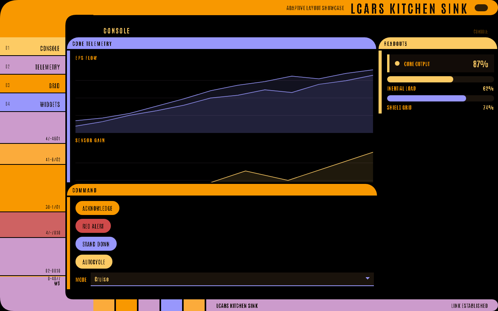

# LCARS-WebUI

LCARS-WebUI is a Python library for building live, browser-rendered LCARS dashboards.
You write Python; the library generates a manifest, FastAPI serves it, and the bundled
React frontend renders authentic Star Trek LCARS geometry in the browser.



## Documentation Map

| Page | Use it when you need to |
|---|---|
| [Getting Started](Getting-Started) | Install the package, run an example, and create a first app. |
| [Build a Dashboard](Build-a-Dashboard) | Build a complete two-page app with controls, logs, and live updates. |
| [Concepts](Concepts) | Understand manifests, reruns, ids, state, effects, pages, and layout. |
| [Layouts](Layouts) | Choose containers and page archetypes without fighting the renderer. |
| [Widgets](Widgets) | Use every supported widget type including charts, shaders, and inputs. |
| [Actions and State](Actions-and-State) | Wire button handlers, stateful inputs, forms, logs, notifications, and streaming. |
| [Recipes](Recipes) | Copy common patterns into your app. |
| [Reference](Reference) | Look up public function signatures and accepted values. |
| [Deployment](Deployment) | Put an app behind HTTPS, auth, CORS, and a reverse proxy. |
| [Troubleshooting](Troubleshooting) | Fix common install, widget, layout, live update, and deployment problems. |
| [Visual Gallery](Visual-Gallery) | Screenshots from code-rendered examples. |

## Minimal App

```python
import lcars_ui as lcars


def ui() -> None:
    lcars.config("Bridge Ops", subtitle="Operations", theme="galaxy")
    lcars.nav("Main", page="main", color="orange-peel")

    with lcars.page("Main", id="main", layout="console"):
        with lcars.data_panel("Readouts", color="anakiwa", id="readouts"):
            lcars.metric("Warp Core", "98%", status="ok", id="warp-core")
            lcars.progress("Shield Recharge", 72, id="shield-recharge")

        with lcars.control_panel("Commands", color="orange", id="commands"):
            if lcars.button("Red Alert", color="red", id="red-alert"):
                lcars.set_alert_condition("red")
                lcars.notify("Battle stations", level="error")


if __name__ == "__main__":
    lcars.run(ui)
```

## Key Concepts

- **No HTML or JS needed** for standard dashboards. Layout, colors, and widgets are
  declared in Python.
- **Rerun model**: every browser action (button click, input change) reruns your `ui`
  function with current input values available as return values.
- **Input widgets return values**: `if lcars.button("Go", id="go"):` and
  `mode = lcars.select("Mode", [...], id="mode")` are normal authoring patterns.
- **Widget IDs are the contract** between the browser, session state, update calls, and
  log streams. Set an explicit `id=` on anything you update or handle.
- **LCARS-first layout**: use `data_panel`, `control_panel`, `box`, `sweep`, and
  `bracket` containers rather than generic rows and cards.
- **Live WebSocket streaming**: push real-time updates from a background loop using
  `@lcars.live(interval=...)` — no polling required.

---

**See Also:** [Getting Started](Getting-Started) · [Concepts](Concepts) · [Reference](Reference)
