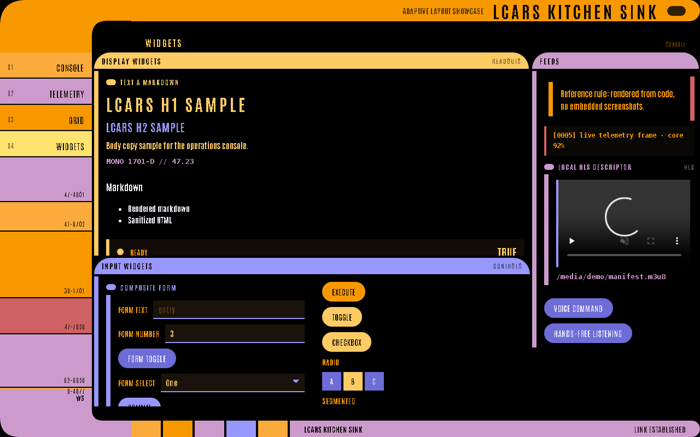

# LCARS-WebUI Wiki

LCARS-WebUI is a Python DSL for building strict LCARS-style server-driven interfaces. This wiki focuses on the supported widgets, how to declare them, and what they look like in the rendered app.

**v2.0 — adaptive layout:** declare panels and the renderer composes them into a viewport-filling LCARS console, choosing a layout archetype (`console` / `telemetry` / `grid` / `menu`) and placing each panel into a zone. See [[Layouts and Containers|Layouts-and-Containers]].

All screenshots here are generated from code-rendered LCARS widgets in `examples/kitchen_sink/app.py`. They are documentation assets only.

## Start Here

- [[Getting Started|Getting-Started]]
- [[Usage Patterns and Edge Cases|Usage-Patterns-and-Edge-Cases]]
- [[Widget Gallery|Widget-Gallery]]
- [[Primitive Widgets|Primitive-Widgets]]
- [[Data Widgets|Data-Widgets]]
- [[Input Widgets|Input-Widgets]]
- [[Media Widgets|Media-Widgets]]
- [[Layouts and Containers|Layouts-and-Containers]]
- [[Live Updates and Actions|Live-Updates-and-Actions]]
- [[Screenshot Catalog|Screenshot-Catalog]]

## Widget Families

| Family | Widgets |
| --- | --- |
| Primitives | `text`, `markdown`, `metric`, `alert`, `progress`, `header` |
| Data | `chart`, `sparkline`, `gauge`, `table` |
| Inputs | `button`, `toggle`, `checkbox`, `select`, `radio`, `radio_toggle`, `text_input`, `number_input`, `form` |
| Media | `log`, `video_hls`, `mic_button` |
| Layouts | `box`, `sweep`, `bracket`, `console`, `padd`, `diagnostic`, `data_panel`, `control_panel`, `section`, `row`, `col`, `columns` |

## Common Usage Questions

- [[How actions, ids, and state work|Usage-Patterns-and-Edge-Cases]]
- [[How to use buttons and inputs|Input-Widgets]]
- [[How to update widgets from handlers|Live-Updates-and-Actions]]
- [[How adaptive LCARS layout chooses zones|Layouts-and-Containers]]

## Full Widget Gallery

