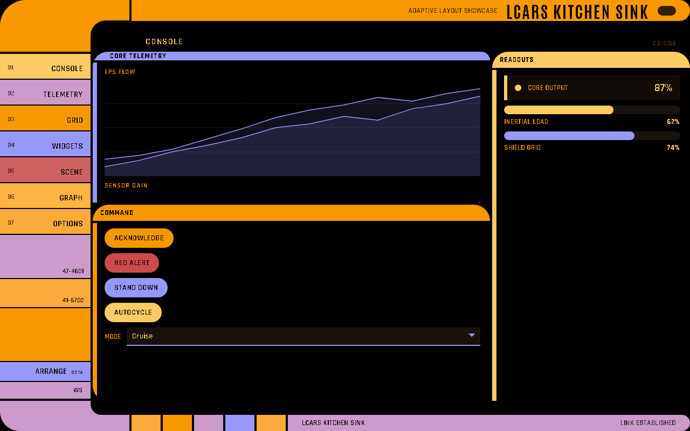

# LCARS-WebUI

LCARS-WebUI 4.5.0 is a Python library for building live, browser-rendered LCARS
applications. Python declares the interface, Pydantic models define a versioned
manifest, FastAPI serves it, and a bundled React frontend renders code-native LCARS
geometry.



## What it can build

- Adaptive operational consoles, telemetry scopes, grid walls, menus, PADDs, and
  diagnostic surfaces.
- Stateful controls, forms, sortable/filterable tables, live logs, notifications,
  financial charts, HLS video, WebGL shaders, Three.js scenes, and editable node graphs.
- Real-time dashboards driven by user actions or a server-side `@lcars.live` task.
- Knowledge-graph clients using eight native evidence, traversal,
  constraint, gap, and commitment instruments.
- Internet-facing applications with scoped token auth, CORS, secure headers, rate
  limits, and bounded uploads.

## Documentation map

| Page | Use it when you need to |
| --- | --- |
| [Getting Started](Getting-Started) | Install, run an example, and build a first app. |
| [Build a Dashboard](Build-a-Dashboard) | Follow a complete multi-page dashboard tutorial. |
| [Concepts](Concepts) | Understand manifests, execution modes, IDs, state, and transport. |
| [Layouts](Layouts) | Choose page archetypes, containers, zones, and sizing hints. |
| [Widgets](Widgets) | Find every supported widget family and its capabilities. |
| [Knowledge Graph](Knowledge-Graph) | Use the eight knowledge-client instruments. |
| [Actions and State](Actions-and-State) | Handle controls, forms, table state, effects, and live updates. |
| [Recipes](Recipes) | Copy practical authoring patterns. |
| [Reference](Reference) | Look up public entry points, accepted values, and routes. |
| [Deployment](Deployment) | Configure HTTPS, auth, limits, uploads, and reverse proxies. |
| [Troubleshooting](Troubleshooting) | Diagnose install, state, upload, layout, and transport issues. |
| [Visual Gallery](Visual-Gallery) | Inspect code-rendered example output. |

## Minimal app

```python
import lcars_ui as lcars


def ui() -> None:
    lcars.config("Bridge Ops", subtitle="Operations", theme="galaxy")
    lcars.nav("Main", page="main", color="orange-peel")

    with lcars.page("Main", id="main", layout="console"):
        with lcars.data_panel("Readouts", zone="side", id="readouts"):
            lcars.metric("Warp Core", "98%", status="ok", id="warp-core")
            lcars.progress("Shield Recharge", 72, id="shield-recharge")

        with lcars.control_panel("Commands", id="commands"):
            if lcars.button("Red Alert", color="red", id="red-alert"):
                lcars.set_alert_condition("red")
                lcars.notify("Battle stations", level="error")


if __name__ == "__main__":
    lcars.run(ui)
```

## Mental model

- **BUILD** creates the typed manifest at startup.
- **HANDLE** reruns the same Python function after a browser action with that session's
  input values restored.
- **LIVE** lets one optional background callback push targeted updates.
- **IDs** route browser actions, retain session state, connect form values, and target
  effects.
- **Layout is semantic:** declare LCARS panels and their content; the renderer composes
  the screen. Use placement hints only when the automatic result needs direction.

The UI remains code-rendered. Reference screenshots are measurement inputs, never page
assets or backdrops.

---

**Next:** [Getting Started](Getting-Started) · [Build a Dashboard](Build-a-Dashboard) ·
[Widgets](Widgets) · [Reference](Reference)
