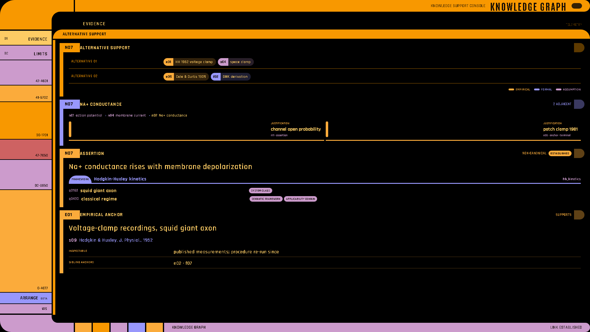
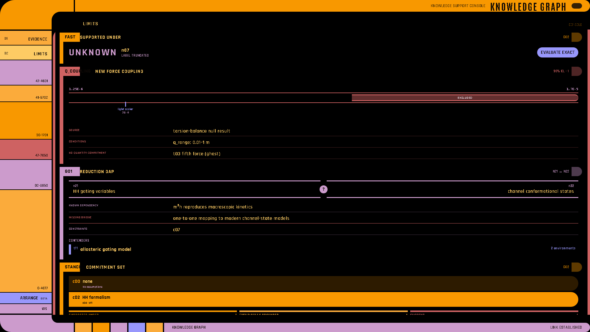

# Knowledge-graph instruments

LCARS-WebUI provides eight native instruments, introduced in 4.5.0, for versioned knowledge-graph
payloads. Each widget accepts a dictionary in the documented shape or its exported
Pydantic type:

`SupportData`, `FrontierData`, `AssertionData`, `AnchorData`, `TriStateData`,
`ConstraintData`, `GapData`, and `CommitmentData`.

The renderer preserves the distinctions carried by the source model. It does not flatten
alternative support environments, turn UNKNOWN into a warning, merge empirical grounding
with conditional support, invent a position for an uncommitted claim, or draw unsupported
constraint representations as intervals.

Run the complete example:

```bash
cd lcars-ui
python examples/knowledge_graph/app.py
```

| Evidence page | Limits page |
| --- | --- |
|  |  |

Use the example's **Evidence** and **Limits** navigation entries to inspect all eight
instruments. The screenshots are generated from that running application rather than a
static mockup.

## Support environments

`support_panel` establishes the assertion context. `environments` renders alternatives
as separate groups of typed atoms, and `atom_legend` explains the atom categories.

```python
support_data = {
    "node": "n07",
    "truncated": False,
    "environments": [
        {"atoms": [
            {"id": "e01", "type": "empirical", "label": "HH 1952 voltage clamp"},
            {"id": "a04", "type": "assumption", "label": "space clamp"},
        ]},
        {"atoms": [
            {"id": "e09", "type": "empirical", "label": "Cole & Curtis 1939"},
            {"id": "f02", "type": "formal", "label": "GHK derivation"},
        ]},
    ],
}

with lcars.support_panel("Support", node="n07", id="support-n07"):
    lcars.environments(support_data)
    lcars.atom_legend()
```

Atom types are `empirical`, `formal`, and `assumption`.

Two empty-looking states mean different things:

- `"environments": []` means unsupported.
- `"environments": [{"atoms": []}]` means support-independent.

`truncated=True` tells the reader that the environment set is incomplete.

## Frontier traversal

`frontier` renders the current node, the path already taken, and only the immediate
neighbors. It returns the validated neighbor ID clicked during the active rerun, or
`None`.

```python
frontier_data = {
    "current": {"id": "n07", "label": "Na+ conductance"},
    "path": [
        {"id": "n01", "label": "action potential"},
        {"id": "n04", "label": "membrane current"},
    ],
    "frontier": [
        {
            "id": "n11",
            "label": "channel open probability",
            "edge": "JUSTIFICATION",
            "kind": "assertion",
            "terminal": False,
        },
        {
            "id": "e03",
            "label": "patch clamp 1981",
            "edge": "JUSTIFICATION",
            "kind": "anchor",
            "terminal": True,
        },
    ],
}

clicked = lcars.frontier(frontier_data, layer_filter=["JUSTIFICATION"], id="frontier-n07")
if clicked:
    navigate_to(clicked)
```

Edges: `JUSTIFICATION`, `DOMAIN`, `PREREQUISITE`, `PROVENANCE`.

Kinds: `assertion`, `anchor`, `gap`, `framework`, `quantity`.

The `layer_filter` affects the rendered one-hop choices; it does not compute or expose a
transitive closure.

## Assertion card and context tags

`assertion_card` is the primary node view. Its framework is singular. `context_tags`
renders every role attached to every qualifier.

```python
assertion_data = {
    "id": "n07",
    "gloss": "Na+ conductance rises with membrane depolarization",
    "canonical": False,
    "framework": {"id": "hh_kinetics", "label": "Hodgkin-Huxley kinetics"},
    "context": [
        {
            "qualifier": "q0182",
            "label": "squid giant axon",
            "roles": ["SYSTEM_CLASS"],
        },
        {
            "qualifier": "q0433",
            "label": "classical regime",
            "roles": ["SEMANTIC_FRAMEWORK", "APPLICABILITY_DOMAIN"],
        },
    ],
    "status": ["established"],
}

with lcars.assertion_card(assertion_data, id="assertion-n07"):
    lcars.context_tags()
```

Context roles: `SEMANTIC_FRAMEWORK`, `APPLICABILITY_DOMAIN`, `SYSTEM_CLASS`,
`STATE_CONDITION`, and `PARAMETER_RESTRICTION`. One qualifier may carry several roles.

## Anchor card

An anchor is empirical evidence or a formal derivation. Its polarity states whether it
supports or excludes, and its source remains visible.

```python
lcars.anchor_card({
    "id": "e01",
    "type": "empirical",
    "label": "Voltage-clamp recordings, squid giant axon",
    "polarity": "SUPPORTS",
    "source": {"id": "s09", "citation": "Hodgkin & Huxley, J. Physiol., 1952"},
    "sibling_anchors": ["e02", "f07"],
    "inspectable": "published measurements; procedure re-run since",
    "status": [],
})
```

Types: `empirical`, `formal`. Polarities: `SUPPORTS`, `EXCLUDES`. Status may include
`retracted` and `superseded`. Sibling anchors are other anchors from the same source.

## Tri-state result

`tri_state` gives `YES`, `NO`, and `UNKNOWN` distinct neutral semantics. UNKNOWN is not
rendered as a warning. When `on_escalate="EXACT"`, it returns `True` only for the
escalation action.

```python
escalate = lcars.tri_state(
    {
        "query": "supported_under",
        "subject": "n07",
        "commitment": "c02",
        "result": "UNKNOWN",
        "mode": "FAST",
        "reason": "label_truncated",
    },
    on_escalate="EXACT",
    id="support-query-n07",
)

if escalate:
    run_exact_query()
```

Results: `YES`, `NO`, `UNKNOWN`. Modes: `FAST`, `EXACT`. Reasons:
`label_truncated`, `no_compatible_environment`, `complete`.

## Constraint band

`constraint_band` positions claims against an excluded interval on a registered
quantity. It renders interval geometry only when `representation="INTERVAL"`.

```python
lcars.constraint_band({
    "quantity": {"id": "q_coupling", "label": "new force coupling", "unit": "1"},
    "representation": "INTERVAL",
    "excluded": {"min": 1e-5, "max": None},
    "confidence": "95% CL",
    "conditions": [
        {"quantity": "q_range", "min": 0.01, "max": 1.0, "unit": "m"},
    ],
    "source": {"id": "s41", "citation": "torsion-balance null result"},
    "claims": [
        {"id": "t03", "label": "fifth force (ghost)", "position": None},
        {"id": "t08", "label": "light scalar", "position": 3e-6},
    ],
})
```

Supported representation values are `INTERVAL`, `INEQUALITY`, `COVARIANCE`,
`LIKELIHOOD`, `CONTOUR`, `FUNCTION`, and `SAMPLES`. Values other than `INTERVAL` are
identified as unrendered rather than mapped to invented interval geometry.

`position=None` means the claim commits to no value on this quantity. It is shown as
uncommitted, not placed at zero or omitted.

## Gap panel and contenders

`gap_panel` marks a region without an established bridge. `contender_list` renders the
contenders from the gap data.

```python
gap_data = {
    "id": "g01",
    "type": "REDUCTION",
    "endpoints": [
        {"id": "n21", "label": "HH gating variables"},
        {"id": "n22", "label": "channel conformational states"},
    ],
    "known_dependency": "m³h reproduces macroscopic kinetics",
    "missing": "one-to-one mapping to modern channel-state models",
    "contenders": [
        {"id": "t11", "label": "allosteric gating model", "environments": 2},
    ],
    "constraints": ["c07"],
}

with lcars.gap_panel(gap_data, id="gap-g01"):
    lcars.contender_list()
```

Gap types: `RELATIONAL`, `MECHANISTIC`, `REDUCTION`, `EVIDENTIAL`, `ONTOLOGICAL`.
`contenders=[]` is a complete and valid state, not missing data.

## Commitment selector

`commitment_selector` lets the reader adopt one available stance. It returns a validated
chosen commitment ID during its action rerun, or `None`.

```python
commitment_data = {
    "available": [
        {"id": "c00", "label": "none", "assumptions": []},
        {"id": "c02", "label": "HH formalism", "assumptions": ["a04", "a11"]},
    ],
    "active": "c02",
    "supported_under": ["n07", "n09"],
    "empirically_grounded": ["n07"],
    "conflict_set": ["n33"],
}

chosen = lcars.commitment_selector(commitment_data, id="commitments")
if chosen:
    reload_under(chosen)
```

`supported_under` and `empirically_grounded` remain separate result sets.
`conflict_set` identifies assertions to suspend and is not an unsupported-assertion list.

## Composition example

```python
def ui() -> None:
    lcars.config("Knowledge Graph", subtitle="Knowledge Support Console", settings_page=False)
    lcars.nav("Evidence", page="evidence")
    lcars.nav("Limits", page="limits")

    with lcars.page("Evidence", id="evidence", layout="telemetry", fillers=False):
        with lcars.support_panel("Alternative support", node="n07"):
            lcars.environments(support_data)
            lcars.atom_legend()

        clicked = lcars.frontier(frontier_data, layer_filter=["JUSTIFICATION"])
        with lcars.assertion_card(assertion_data):
            lcars.context_tags()
        lcars.anchor_card(anchor_data)

        if clicked:
            navigate_to(clicked)

    with lcars.page("Limits", id="limits", layout="console", fillers=False):
        if lcars.tri_state(result_data, on_escalate="EXACT"):
            run_exact_query()
        lcars.constraint_band(constraint_data)
        with lcars.gap_panel(gap_data):
            lcars.contender_list()

        chosen = lcars.commitment_selector(commitment_data)
        if chosen:
            reload_under(chosen)
```

All instruments support the common visibility, placement, color, and hint arguments. The
frontier, tri-state, and commitment selector validate action payloads so an unknown
browser-supplied ID or mode is not returned to application code.

---

**See also:** [Widgets](Widgets) · [Actions and State](Actions-and-State) ·
[Reference](Reference) · [4.5.0 release notes](https://github.com/darsrc/LCARS-WebUI/blob/main/lcars-ui/docs/release-v4.5.0.md)
