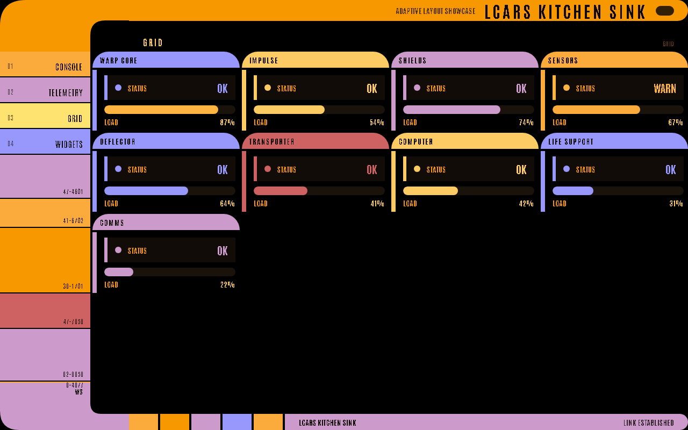
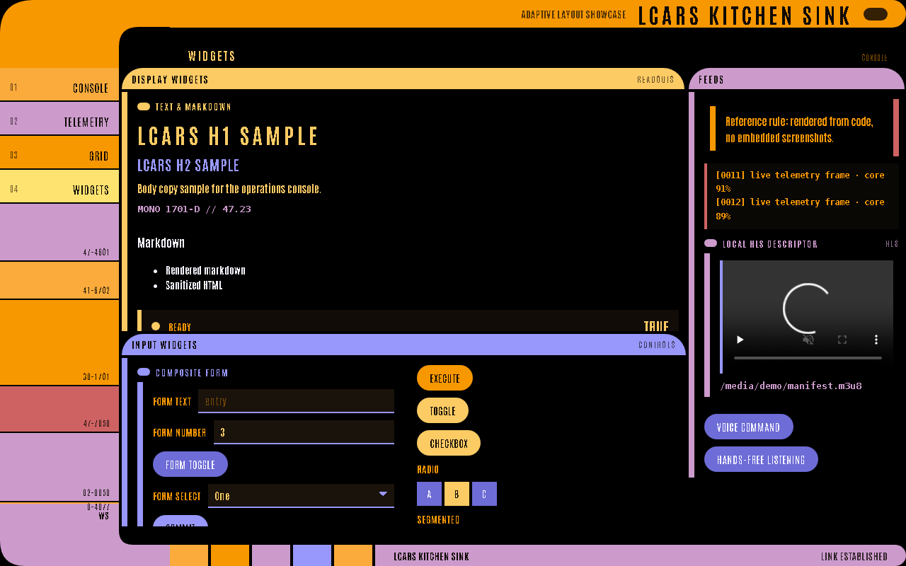
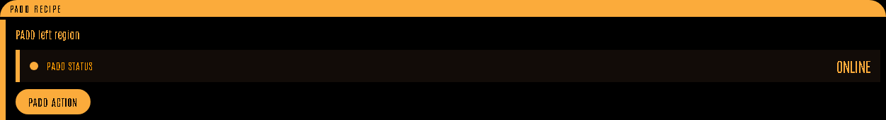
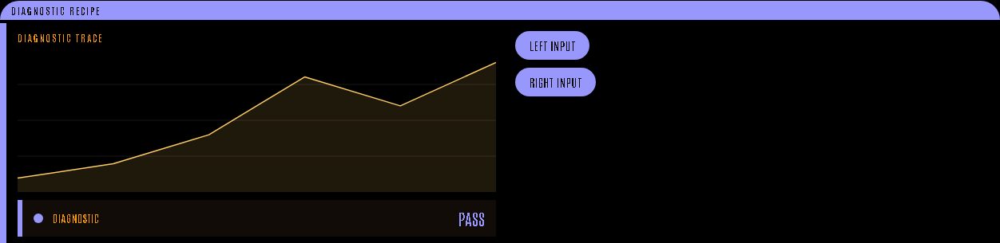

# Layouts and Containers

LCARS-WebUI favors composed LCARS geometry over generic card layouts. Use containers to shape the page before adding widgets.



## Which Container Should I Use?

| Need | Use | Why |
| --- | --- | --- |
| General dashboard data | `data_panel` | Auto-places as primary or side content based on the page layout. |
| Buttons and inputs | `control_panel` | Defaults nested widgets into an input-oriented LCARS panel. |
| Full command surface | `console` | Gives you sweep regions for header, inputs, left content, and right content. |
| Compact detail screen | `padd` | Dense PADD-like structure for review or status pages. |
| Diagnostic view | `diagnostic` | Full-frame diagnostic panel with main, side, and input slots. |
| Custom framed group | `box` | Lower-level LCARS box with main, side, and input regions. |
| Sweep geometry | `sweep` | Lower-level left/right sweep composition. |
| Simple LCARS grouping | `bracket` | Lightweight bracket around a local group of widgets. |
| Compatibility split | `row` / `col` / `columns` | Explicit grid layout when a strict LCARS container is not enough. |

## Adaptive layout (v2.0)

You don't hand-place panels on a scrolling page. You declare panels at page level, and the renderer composes them into a **viewport-filling LCARS console** — an asymmetric, zoned bracket that fits the screen, with overflow living inside a panel rather than scrolling the whole page.

### Archetypes

A page renders under a *layout archetype*. Pass `layout=` to `lcars.page`, or leave it `"auto"` (default) and the engine picks one from the panel mix:

| Archetype | Shape | Good for |
| --- | --- | --- |
| `console` | primary data lane + side readout rail + control dock | everyday dashboards |
| `telemetry` | one dominant data scope + a narrow readout rail | a single big chart / monitor |
| `grid` | a periodic-table-style wall of equal cells | many small homogeneous panels |
| `menu` | sparse field with generous negative space | selection / navigation screens |

```python
with lcars.page("Sensor Sweep", layout="telemetry"):
    with lcars.data_panel("Field Density"):
        lcars.chart(field_series, title="Density")
    with lcars.data_panel("Lock Status", zone="side"):
        lcars.metric("Lock", "ACQUIRED", status="ok")
```

`auto` heuristics: ≥6 panels → `grid`; one or two panels dominated by a data viz → `telemetry`; otherwise `console`.

### Zones and auto-placement

Within `console` / `telemetry` / `menu`, each panel lands in a zone chosen by its content:

- **primary** — panels carrying charts, tables, logs, or substantial text → the main lane
- **side** — compact readout panels (metrics, gauges, progress) → the status rail
- **dock** — control panels (buttons, toggles, inputs, forms) → the bottom dock

Override any single panel with the `zone=` hint:

```python
with lcars.data_panel("Readouts", zone="side"):   # force into the rail
    lcars.metric("Core Output", "87%", status="ok")
```

Valid zones: `"primary"`, `"side"`, `"dock"`, `"full"`. In a `grid` page every panel is a cell. The console never leaves the primary lane empty — if nothing classifies as primary, the first panel is promoted.

### Containers are the panels

The containers below (`box`, `console`, `data_panel`, `control_panel`, `diagnostic`, `padd`, `sweep`, `bracket`) are the panels the adaptive engine places. Declare several at page level and let the layout arrange them; use the containers' own slots (`.main()`, `.side()`, input columns) to shape a panel's interior.

For most apps, start with page-level `data_panel` and `control_panel`. Move to `console`,
`padd`, `diagnostic`, `sweep`, or `box` when you need explicit regions inside one panel.

## `box`

Use `box` for a framed content region with optional side/input regions.

```python
with lcars.box("Display Widgets", subtitle="Readouts", color="pale-canary") as box:
    with box.main():
        lcars.header("Text and Markdown", size="h3")
        lcars.text("LCARS H1 SAMPLE", size="h1")

    with box.side():
        lcars.metric("Ready", "TRUE", status="ok")
        lcars.progress("Decode", 42)
```

## `console`

Use `console` for a full command-console composition with header, input column, and left/right content regions.

```python
with lcars.console("Command Console", color="pale-canary") as console:
    with console.header():
        lcars.header("Operational Summary", size="h3")

    with console.column_inputs():
        lcars.button("Acknowledge")
        lcars.toggle("Autocycle", value=True)

    with console.left():
        lcars.metric("Core Output", "87%", status="ok")

    with console.right():
        lcars.chart([1, 3, 5, 8], title="EPS Flow")
```

## `sweep`

Use `sweep` for LCARS sweep geometry with explicit regions.



```python
with lcars.sweep("Reverse Sweep", subtitle="Explicit Regions", reverse=True) as sweep:
    with sweep.header():
        lcars.header("Sweep Header Slot", size="h4")
    with sweep.column_inputs():
        lcars.button("Sweep Input")
    with sweep.left():
        lcars.text("Left sweep content")
    with sweep.right():
        lcars.text("Right sweep content")
```

## `padd`

Use `padd` for a compact PADD-style recipe.



```python
with lcars.padd("PADD Recipe", color="golden-tanoi") as padd:
    with padd.column_inputs():
        lcars.button("PADD Action")
    with padd.left():
        lcars.text("PADD left region")
    with padd.right():
        lcars.metric("PADD Status", "ONLINE")
```

## `diagnostic`

Use `diagnostic` for diagnostic panels with input rails and data areas.



```python
with lcars.diagnostic("Diagnostic Recipe", color="blue") as diag:
    with diag.left_inputs():
        lcars.button("Left Input")
    with diag.right_inputs():
        lcars.button("Right Input")
    with diag.main():
        lcars.chart([2, 4, 8, 16, 12, 18], title="Diagnostic Trace")
    with diag.side():
        lcars.metric("Diagnostic", "PASS", status="ok")
```

## `bracket`, `row`, `col`, and `columns`

Use brackets for LCARS grouping and rows/columns for explicit layout splits.

```python
with lcars.row(height="auto"):
    with lcars.col("1fr"):
        with lcars.bracket(color="anakiwa", orientation="left"):
            lcars.text("Left bracket")

    with lcars.col("1fr"):
        with lcars.bracket(color="hopbush", orientation="right"):
            lcars.text("Right bracket")
```
