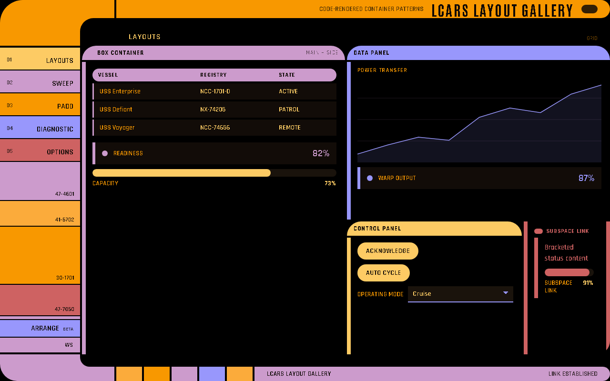

# Layouts

LCARS-WebUI works best when you compose pages from LCARS-native panels instead of generic
rows of cards.



## Page archetypes

```python
@app.page("Overview", id="overview", layout="console")
def overview() -> None:
    ...
```

| Layout | Shape | Use for |
| --- | --- | --- |
| `auto` | Renderer chooses from content. | Early prototyping. |
| `console` | Primary lane, side rail, control dock. | Operational dashboards. |
| `telemetry` | Dominant data scope and side readouts. | Big charts, monitors, sensor pages. |
| `grid` | Equal cells. | Repeated subsystem panels. |
| `menu` | Sparse command field. | Focused detail or selection pages. |
| `authored` | Explicit caller-declared CSS Grid topology. | Canon-sensitive or spatial screens that must not be repacked. |

## Authored composition

Use authored layout only when spatial topology carries information. It is an opt-in
escape from the adaptive mosaic, not the default dashboard tool.

```python
@app.page("Exact Surface", id="exact", layout="authored", chrome="none")
def exact() -> None:
    with advanced.composition(
        columns=[advanced.px(120), advanced.fr(1), advanced.fr(2)],
        rows=[advanced.px(64), advanced.fr(1)],
        design_size=(1440, 900),
        narrow="scroll",  # scroll | scale | adaptive
    ) as stage:
        with stage.area("title", row=1, column=2, column_span=2):
            ui.text("EXACT SURFACE", size="display")
        with stage.area("rail", row=2, column=1, decorative=True):
            ui.bar(color="orange", caps="both", thickness=28)
```

(Executed via `app.build_manifest()` while writing this page.)

An authored page requires exactly one top-level `advanced.composition()`, plus optional
pop-ups. Areas use one-based row/column placement and reject same-layer overlap.
`advanced.px`, `advanced.fr`, `advanced.auto`, and `advanced.minmax` build validated
track strings. `chrome="none"` removes the standard console shell. At narrow widths,
`scroll` preserves geometry, `scale` scales it, and `adaptive` repacks only
non-decorative content through the normal mosaic.

## Surface geometry

Use `advanced.surface()` when an authored screen needs non-rectangular topology such as
arcs, polygons, routed paths, or mirrored and repeated consoles. It combines
code-rendered geometry with positioned regions that can host ordinary widgets. See the
[Surface Engine](Surface-Engine) page for the full reference.

## Container selection

| Need | Use |
| --- | --- |
| Charts, tables, metrics, logs, readouts | `ui.data_panel` |
| Buttons, toggles, selects, text inputs | `ui.control_panel` |
| A full command surface with explicit regions | `advanced.console` |
| A compact review/detail screen | `advanced.padd` |
| A diagnostic frame with main/side/input areas | `advanced.diagnostic` |
| Custom framed LCARS region | `ui.box` |
| Explicit sweep geometry | `advanced.sweep` |
| Lightweight local grouping | `advanced.bracket` |
| Legacy/manual grid split | `ui.row`, `ui.col`, `ui.columns` |

## Recommended default

Start with page-level `ui.data_panel` and `ui.control_panel`.

```python
@app.page("Ops", id="ops", layout="console")
def ops() -> None:
    with ui.data_panel("Telemetry", id="telemetry"):
        ui.chart([1, 3, 5, 8], title="EPS Flow")

    with ui.data_panel("Readouts", zone="side", id="readouts"):
        ui.metric("Core Output", "87%", status="ok")

    with ui.control_panel("Actions", id="actions"):
        ui.button("Refresh", id="refresh")
```

(Executed while writing this page.)

## Zones

Zones hint where a page-level panel should land.

| Zone | Meaning |
| --- | --- |
| `primary` | Main content lane. |
| `side` | Side readout rail. |
| `dock` | Control dock. |
| `full` | Full page span or grid cell. |

```python
with ui.data_panel("Readouts", zone="side", id="readouts"):
    ui.metric("Core Output", "87%", status="ok")
```

The adaptive renderer promotes a panel into the primary lane if a non-grid page would
otherwise have no primary content.

## Footprint and sizing hints

The renderer infers panel size from content, then shares the usable deck among panels.
These hints are accepted by top-level containers and most widgets:

| Hint | Meaning |
| --- | --- |
| `span=(columns, rows)` | Pin an exact mosaic footprint. |
| `weight=1..12` | Anchor more important panels earlier and larger. |
| `aspect="wide" \| "tall" \| "square" \| "flex"` | Override inferred shape. |
| `group="name"` | Ask the packer to keep related panels adjacent. |
| `sizing="fill" \| "content"` | Fill free deck space or keep intrinsic height. |

Pages default to `sizing="fill"`. A collapsed panel always shrinks to its title band,
and the released space is redistributed. Pass `@app.page(..., fillers=False)` for dense
pages where decorative LCARS blocks would compete with data.

```python
@app.page("Ops", id="ops", layout="console", sizing="fill", fillers=False)
def ops() -> None:
    with ui.data_panel("Warp Field", weight=11, aspect="wide", id="warp-field"):
        ui.chart([82, 84, 87, 91])
    with ui.data_panel("Coolant", group="eps", zone="side", id="coolant"):
        ui.gauge("Flow", 72, unit="%")
    with ui.control_panel("EPS", group="eps", id="eps-controls"):
        ui.button("Purge", id="purge")
```

(Executed while writing this page.)

## `data_panel`

```python
with ui.data_panel("Core Telemetry", color="anakiwa", id="core-telemetry"):
    ui.chart([1, 3, 5, 8], title="EPS Flow")
    ui.table([{"System": "Core", "State": "Nominal"}], title="Systems")
```

Use it for charts, tables, logs, metrics, gauges, progress bars, markdown, and grouped
readouts.

## `control_panel`

```python
with ui.control_panel("Operator Actions", color="orange", id="actions"):
    ui.select("Mode", ["Cruise", "Alert"], value="Cruise", id="mode")
    ui.button("Apply", id="apply")
```

Nested widgets default into an input-oriented LCARS region. Register `@app.action("apply")`
to react to the click — see [Actions and State](Actions-and-State).

## `console` (`advanced`)

Use `console` when one panel needs explicit slots.

```python
with advanced.console("Bridge Console", color="pale-canary", id="bridge-console") as console:
    with console.header():
        ui.header("Operational Summary", size="h3")

    with console.column_inputs():
        ui.button("Acknowledge", id="ack")

    with console.left():
        ui.metric("Core", "87%", status="ok")

    with console.right():
        ui.chart([1, 3, 5, 8], title="EPS")
```

## `box` (`ui`)

```python
with ui.box("Display Widgets", subtitle="Readouts", color="pale-canary", id="display") as box:
    with box.main():
        ui.text("LCARS H1 SAMPLE", size="h1")
    with box.side():
        ui.metric("Ready", "TRUE", status="ok")
```

`box` is a lower-level framed container. It supports `main`, `side`, `left_inputs`, and
`right_inputs` slots.

## `sweep` (`advanced`)

```python
with advanced.sweep("Reverse Sweep", reverse=True, id="sweep") as sweep:
    with sweep.header():
        ui.header("Sweep Header", size="h4")
    with sweep.column_inputs():
        ui.button("Sweep Input", id="sweep-input")
    with sweep.left():
        ui.text("Left content")
    with sweep.right():
        ui.chart([1, 2, 3], title="Trace")
```

Use it when you need explicit sweep geometry.

## `padd` and `diagnostic` (`advanced`)

```python
with advanced.padd("Crew Transfer", color="golden-tanoi", id="crew-transfer") as padd:
    with padd.column_inputs():
        ui.button("Approve", id="approve-transfer")
    with padd.left():
        ui.markdown("### Transfer\n\nPending command review.")
    with padd.right():
        ui.metric("Status", "READY", status="ok")
```

```python
with advanced.diagnostic("Diagnostic", color="blue", id="diagnostic") as diag:
    with diag.main():
        ui.chart([2, 4, 8, 16], title="Trace")
    with diag.side():
        ui.metric("Diagnostic", "PASS", status="ok")
```

(All of the above — `console`, `box`, `sweep`, `padd`, `diagnostic` — executed together
while writing this page.)

## Compatibility layout

`ui.row`, `ui.col`, and `ui.columns` still exist for explicit splits.

```python
with ui.row():
    with ui.col("2fr"):
        ui.chart([1, 2, 3], title="Primary")
    with ui.col("1fr"):
        ui.metric("Status", "OK")
```

(Executed while writing this page — using `row`/`col` directly at page level emits an
advisory `UserWarning` in strict mode, suggesting `console`/`box`/`sweep` instead; output
is still structurally lowered either way.) Prefer LCARS containers first; use
compatibility layout only when the container grammar does not describe the screen.

## Pop-ups and rich hints

`advanced.popup()` and `ui.hint()` are overlays, not mosaic cells. They can contain
recursive widget content without changing the page's packed geometry.

```python
with advanced.popup("Transfer Details", modal=False, draggable=True, resizable=True, id="transfer-details"):
    ui.markdown("### Cargo\n\nThree containers accepted.")

ui.button("Inspect", id="inspect")
with ui.hint("inspect", trigger="click", placement="right"):
    ui.metric("Core", "87%", status="ok")
```

(Executed while writing this page.)

## Arrange mode

The renderer's **Arrange** control lets a viewer drag, resize, group, or swap panels and
add persistent rows, columns, and named sections. Arrangements are stored locally per
page and screen size. **Reset** returns to the automatic mosaic. No arrangement data is
sent to Python or serialized into the manifest.

---

**See Also:** [Widgets](Widgets) · [Concepts](Concepts) · [Recipes](Recipes) · [Visual Gallery](Visual-Gallery)
