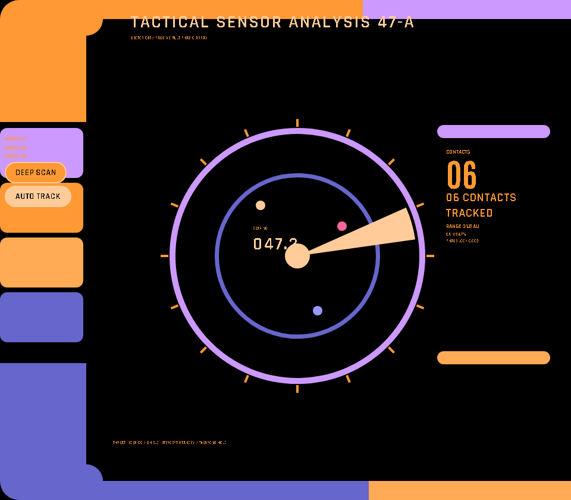
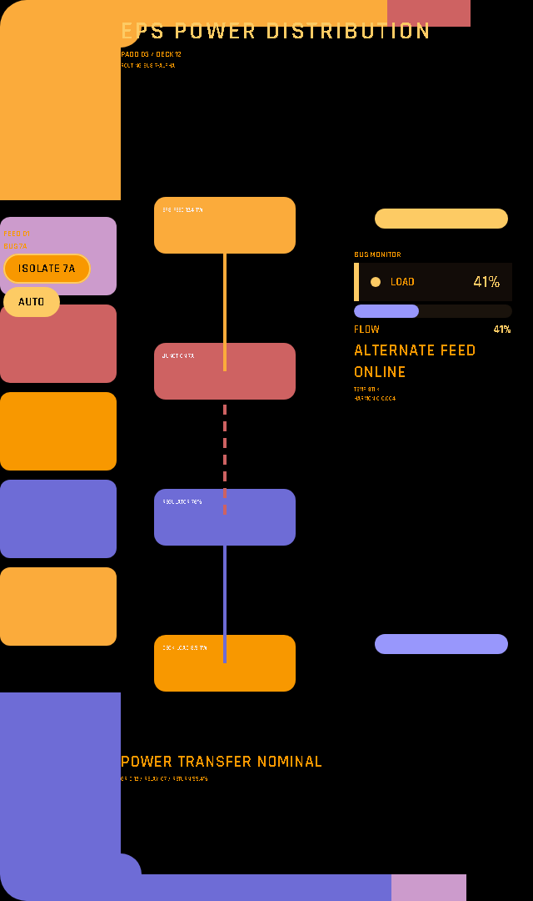
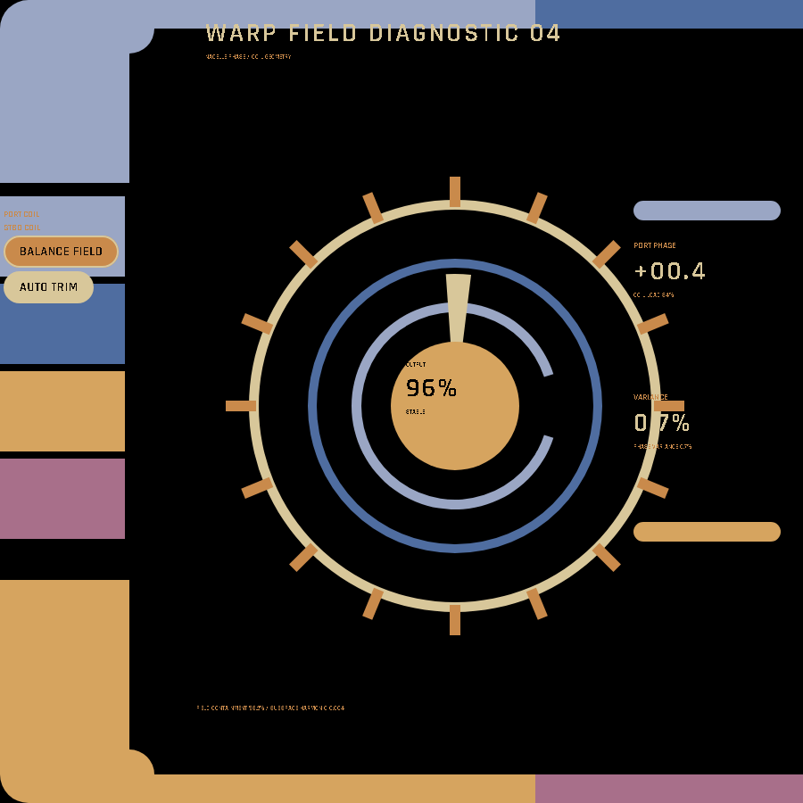
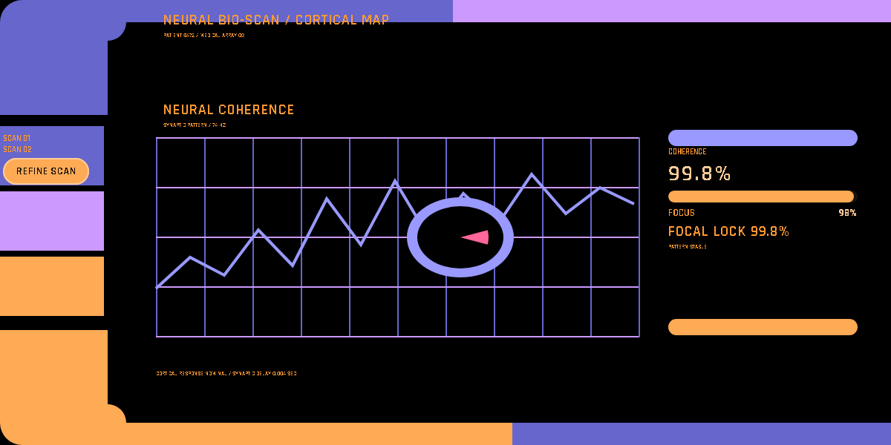
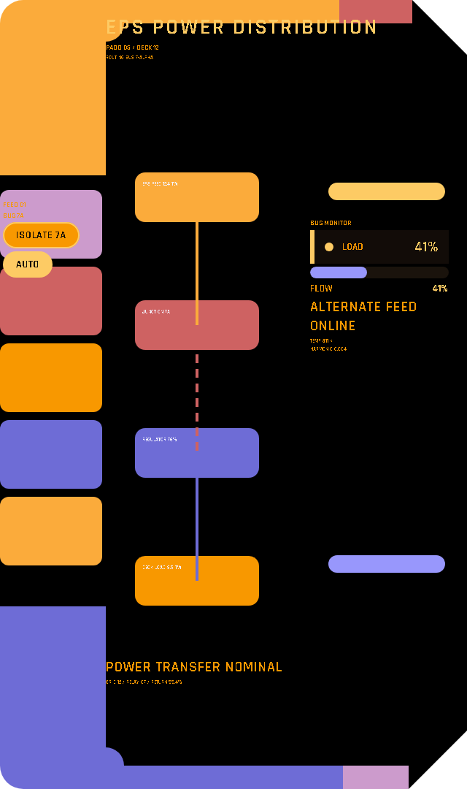

# Surface Engine

`lcars.surface()` is the authored canvas for screens whose topology cannot be expressed as a
rectangular grid. Use it for radial instruments, polygonal frames, routed diagrams, mirrored or
repeated consoles, and other geometric displays. The geometry is rendered as SVG while ordinary
LCARS widgets live in positioned HTML regions; no screenshot or raster backdrop is involved.

Choose the adaptive mosaic for ordinary responsive dashboards, `lcars.composition()` for exact
rows and columns, and `lcars.surface()` when the screen itself is geometric.

A surface does not replace LCARS composition. Rails, elbows, terminals, attached control columns,
and one dominant operational field should still establish the hierarchy. Radial and irregular
geometry belongs inside that system; a novelty silhouette with floating widgets is not sufficient.

## Gallery

These five operational displays use different viewport proportions while preserving canonical
TNG-first LCARS grammar. Every control updates the instrument it belongs to.


*Seismic monitor (1200×900, TNG) — coupled elbows, an attached event rail, dense numerical
telemetry, and a dominant waveform field turn the Surface into an operational LCARS console.*



*Tactical sensor (960×840, TNG) — a polar scanner sits inside an asymmetric console with an
attached command rail and a dedicated contact stack. `DEEP SCAN` resolves six contacts.*



*EPS distribution PADD (640×1080, Galaxy) — control segments, elbows, and live connectors form
one power-routing composition. `ISOLATE 7A` brings the alternate feed online.*



*Warp field diagnostic (900×900, Nemesis) — repeated radial geometry remains subordinate to the
LCARS frame, command rail, and metric hierarchy. `BALANCE FIELD` corrects the phase variance.*



*Neural bioscan (1200×600, TNG) — the waveform owns the main field while the ellipse is only a
local focus reticle. Patient controls and metrics remain attached to the surrounding composition.*

A surface's silhouette is the actual paint boundary, not a rectangle with a shaped decal
on it: the page background is fully transparent outside the housing geometry. Cut the
device or embed's viewport to the same shape and only the authored console renders — no surrounding
black rectangle.



*Same PADD, page background made transparent — the clipped corners are the actual paint boundary,
not a screenshot or rectangular backdrop.*

## Start with shapes and regions

A surface uses design coordinates. Basic geometry includes `rect`, `rounded_rect`, `capsule`,
`circle`, and `ellipse`; geometry nodes do not contain widgets. Put text, controls, charts, or
containers inside a `region()` placed over the geometry.

```python
with lcars.page("Tactical Sensor", layout="authored", chrome="none"):
    with lcars.surface(design_size=(960, 840), min_width=600, narrow="scale") as surface:
        surface.rect(0, 0, 960, 840, color="#000", id="tactical-viewport-base")
        surface.elbow(
            0, 0, 610, 205, 145, 32, "top-left",
            color="atomic-tangerine", id="tactical-header-elbow",
        )
        surface.ring(500, 430, 205, 215, 0, 360, color="lilac", id="scan-rim")
        surface.wedge(500, 430, 0, 200, 336, 352, color="anakiwa", id="scan-sweep")
        with surface.region("commands", x=8, y=228, w=124, h=350):
            lcars.button("DEEP SCAN", color="atomic-tangerine", id="deep-scan")
```

Give multiple surfaces in one manifest distinct IDs. Layers are `geometry`, `content`, `overlay`,
and `effects`; same-layer regions reject rectangular overlap after placement is resolved.

## Anchors and narrow layouts

Rectangles, rounded rectangles, capsules, and regions can use edge anchors, centers, and matched
sizes instead of fixed `x`, `y`, `w`, and `h`. Plain `anchor_left`, `anchor_right`, `anchor_top`,
and `anchor_bottom` values are surface-edge insets. Use `lcars.edge_anchor()` to position a node
from another node, and `match_width_of` or `match_height_of` to share a resolved size.

```python
surface.rounded_rect(0, 60, 220, 840, color="mariner", id="left-rail")
surface.rounded_rect(
    y=60, w=220, h=840, anchor_right=0,
    color="mariner", id="right-rail",
)
with surface.region(
    "viewscreen",
    anchor_left=lcars.edge_anchor("left-rail", "right", offset=24),
    anchor_right=lcars.edge_anchor("right-rail", "left", offset=24),
    anchor_top=70,
    anchor_bottom=20,
):
    lcars.text("MAIN VIEWSCREEN", size="h1", align="center")
```

The default `narrow="scroll"` preserves a minimum-width stage. `narrow="scale"` shrinks the
whole topology uniformly. `narrow="fluid"` requires `narrow_design_size=(width, height)` and
resolves the same anchors against both wide and narrow coordinate spaces, allowing anchored
rails and central regions to move or stretch without shrinking controls.

## Arcs, rings, wedges, and polar tracks

Angles are degrees, with `0` pointing east and increasing clockwise. `arc()` draws an open
stroke; `ring()` draws an annular segment; `wedge()` draws a filled radial segment or a pie slice
when its inner radius is zero.

```python
surface.ring(450, 450, 230, 245, 0, 360, color="lilac", id="scan-ring")
surface.wedge(450, 450, 0, 210, 0, 18, color="neon-carrot", id="sweep")

compass = surface.polar(
    center_x=450, center_y=450,
    inner_radius=260, outer_radius=320,
    start_angle=0, end_angle=360,
    tracks=4, gap_deg=8,
)
for index, label in enumerate(["000", "090", "180", "270"]):
    with compass.track(index):
        lcars.text(label, size="micro", align="center")
```

`polar()` divides an angular band into equal widget-bearing tracks. Track regions use loose,
axis-aligned bounds around their curved sectors, so they are exempt from ordinary region overlap
checks.

## Paths and routed geometry

Use `elbow()` for a four-corner LCARS bracket and `polygon()` for any closed list of points.
`path()` accepts typed `move`, `line`, `arc`, and `close` commands; set `filled=False` for an open
or outlined path.

```python
surface.path(
    [
        {"op": "move", "x": 400, "y": 175},
        {"op": "arc", "rx": 220, "ry": 220, "x": 400, "y": 525},
        {"op": "arc", "rx": 220, "ry": 220, "x": 400, "y": 175},
    ],
    filled=True,
    color="lilac",
    id="lens-housing",
)
```

`connector(from_, to, style=...)` routes between previously declared nodes using `straight`,
`elbow`, or `bezier` geometry. `text_path(path_ref, text)` follows a declared path-rendering
primitive or connector. `ticks()` is a convenience helper that builds radial marks and optional
labels from paths and regions.

```python
surface.circle(450, 350, 90, color="mariner", id="core")
surface.rounded_rect(90, 90, 120, 60, color="orange", id="sensor")
surface.connector("sensor", "core", style="bezier", color="orange", id="sensor-link")
surface.arc(450, 350, 130, 200, 340, color="lilac", id="label-arc")
surface.text_path("label-arc", "WARP FIELD", start_offset=8, color="lilac")
surface.ticks(450, 350, 160, 200, 340, 5, labels=["A", "B", "C", "D", "E"])
```

## Transform groups

A `surface.group()` keeps one child template and transforms it at render time. Use `mirror="x"`,
`"y"`, or `"xy"`; `repeat_linear` or `repeat_radial`; and `rotate` with an optional pivot.
Mirror and repeat modes are mutually exclusive, but either can be combined with rotation.

```python
with surface.group(
    repeat_radial={"count": 12, "center": (400, 400),
                   "start_angle": 0, "end_angle": 330},
    id="teeth-group",
) as group:
    group.rect(380, 140, 40, 70, color="mariner", id="tooth")
```

SVG geometry receives the full transform. Repeated or mirrored HTML regions are repositioned as
axis-aligned boxes, while their text and controls remain upright and readable.

## Effects

Attach `effect()` to an already-declared geometry target. A `sweep` rotates continuously or
between angle bounds, `pulse` animates opacity or alternates two LCARS colors, and `flow` moves a
dash pattern along path-rendering geometry. Reduced-motion preferences automatically disable the
animations.

```python
surface.arc(400, 400, 340, 0, 360, color="lilac", id="rim-arc")
surface.effect("rim-arc", "flow", period_ms=1500, direction="cw")

surface.wedge(400, 400, 0, 300, 0, 15, color="neon-carrot", id="scanner")
surface.effect("scanner", "sweep", period_ms=4000, direction="cw")
```

## Nesting

A surface region can host another `lcars.surface()` or an `lcars.composition()`. This is useful
when an irregular outer housing contains a conventional inner grid, or when one rectangular area
needs its own geometric instrument. Size the nested layout for its actual host region and give a
nested surface an ID distinct from its parent.

```python
with surface.region("console-content", x=100, y=100, w=700, h=500):
    with lcars.composition(
        columns=["1fr", "1fr", "1fr"],
        rows=["70px", "1fr"],
        design_size=(700, 500),
        min_width=700,
        id="console-grid",
    ) as grid:
        with grid.area("title", row=1, column=1, column_span=3):
            lcars.text("PATIENT MONITOR", size="h2", align="center")
```

---

**Next:** [Reference](Reference) · [Recipes](Recipes)
