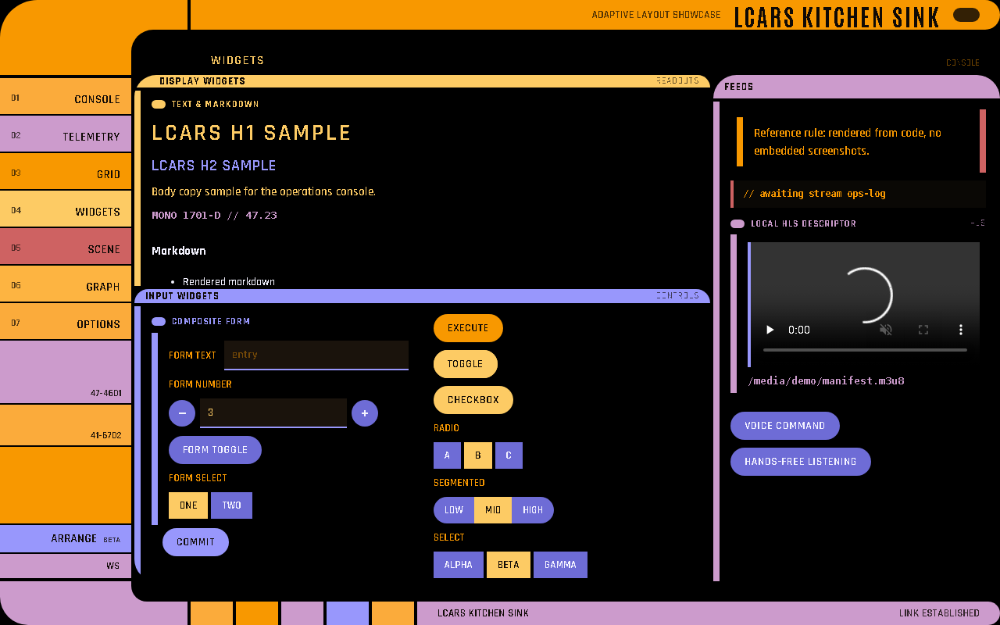
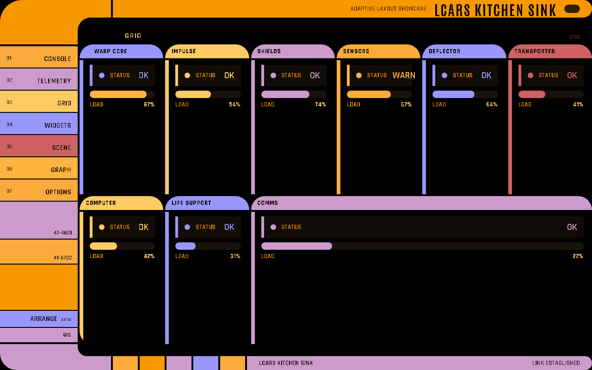
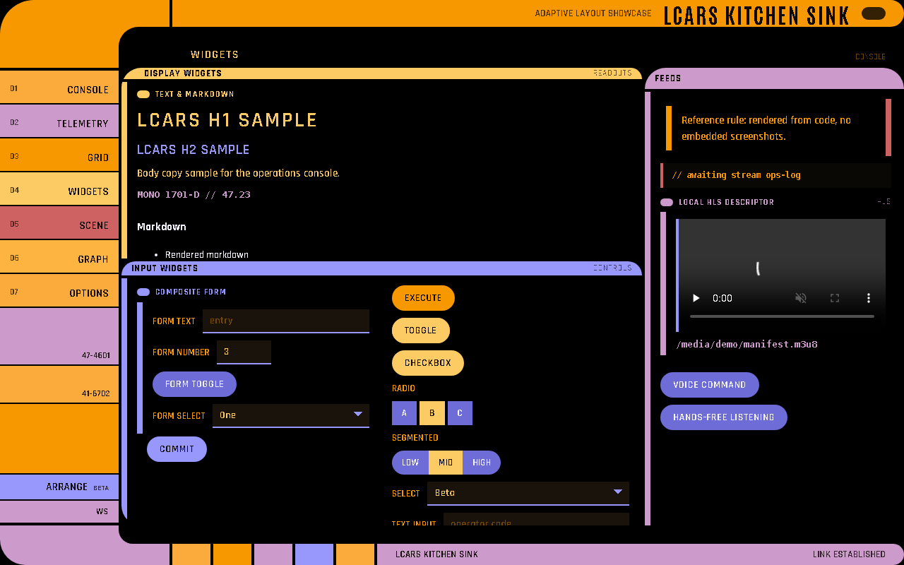
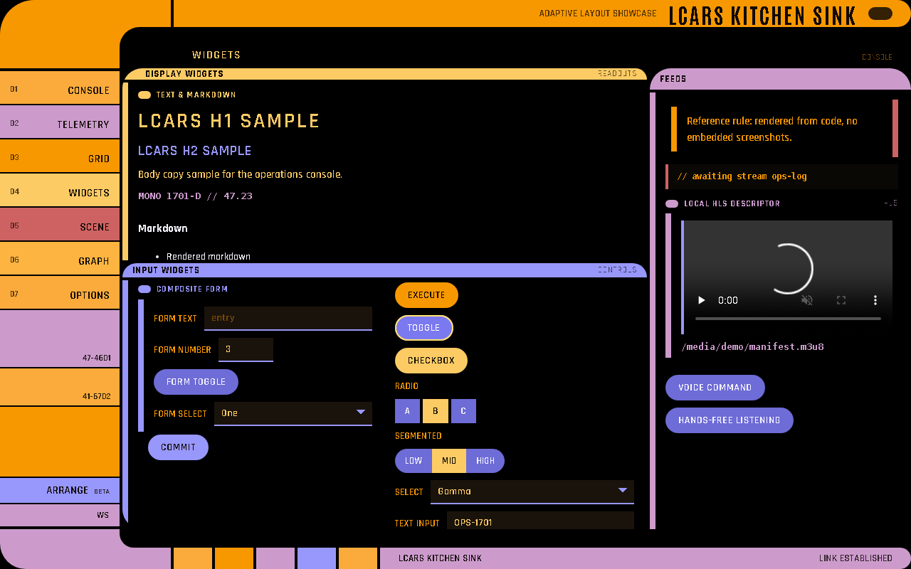
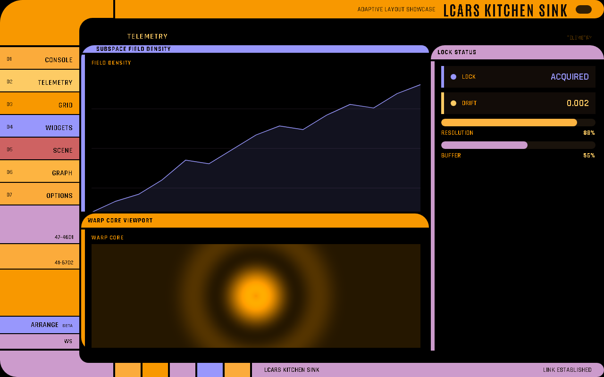
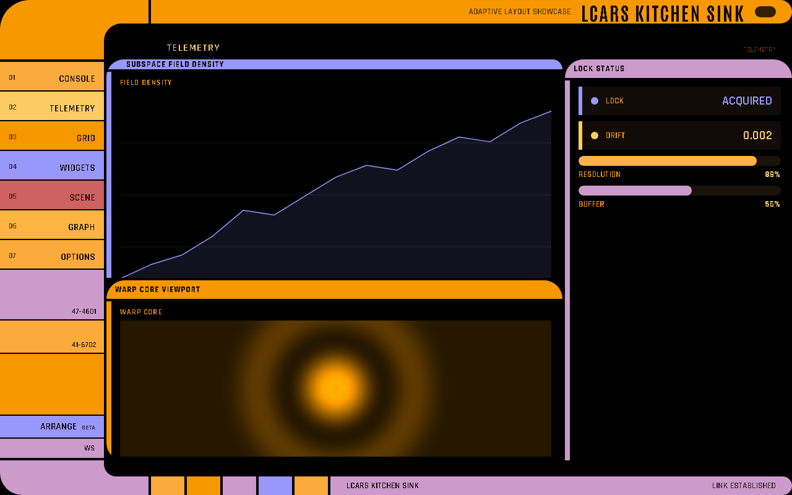
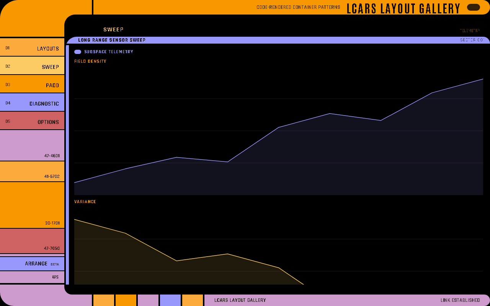
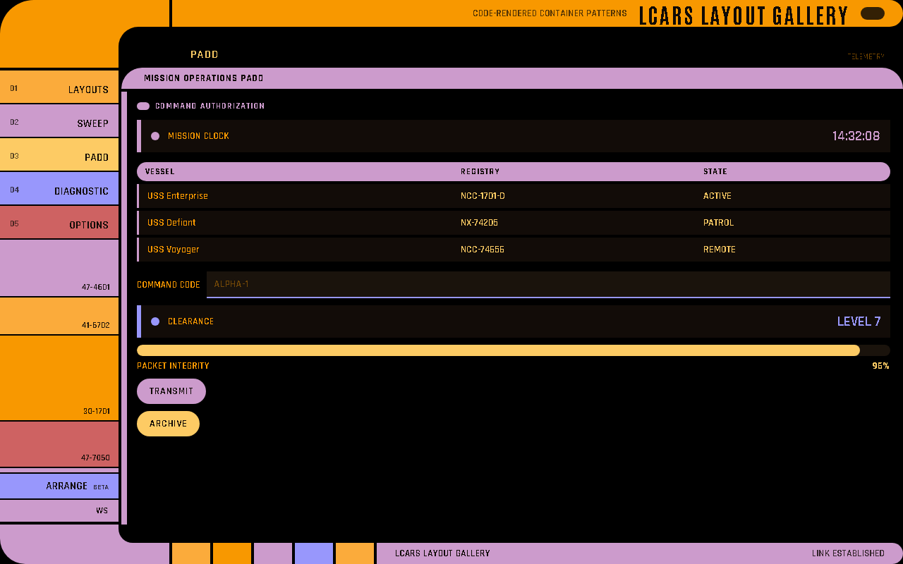
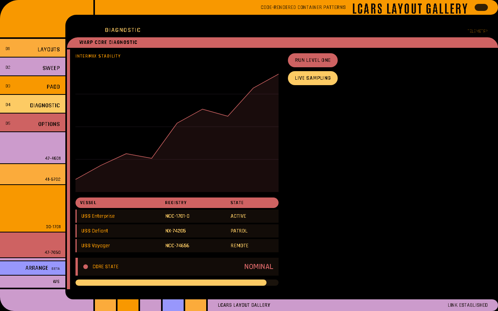

# Visual Gallery

Screenshots generated from live code-rendered LCARS-WebUI examples. All images are
captured from running apps — no static mockups or design tools.

The application surfaces themselves are code-rendered geometry and content. These
documentation captures are examples only; they are not embedded as UI backdrops.

## Console Archetype

Primary data lane (left), side readouts (right), control dock (bottom).


## Core Widget Gallery

A broad widget set rendered across a single page. Newer interactive surfaces are listed
below and are best inspected live.



## Display Widget States

`metric` status variants (`ok` / `warn` / `crit`), `alert` severity bands, `progress` fill levels.



## Input Widgets

Initial state:



Active / interacted state:



## Data Readouts

Gauge, sparkline, and metric readouts on a side rail.



## Telemetry Archetype

Dominant data scope filling the primary zone with a readout rail.



## Layout Containers

The LCARS-native containers: `data_panel`, `control_panel`, `box`, `sweep`.


## Sweep Container

`lcars.sweep` with header rail, column inputs, and bilateral content lanes.



## PADD Container

`lcars.padd` for detail and form views in the menu archetype.



## Diagnostic Container

`lcars.diagnostic` with main and side zones for paired data and control views.



## Newer interactive surfaces

The current codebase also includes rich hints, movable pop-ups and notifications,
enhanced tables, file upload, managed Three.js scenes, an editable node canvas, and all
eight The Web instruments. Run these live examples for the current interactive views:

```bash
cd lcars-ui
python examples/widget_capabilities/app.py
python examples/table_repositories/app.py
python examples/vibe_coder/app.py
python examples/the_web/app.py
```

---

**See Also:** [Layouts](Layouts) · [Widgets](Widgets) · [Build a Dashboard](Build-a-Dashboard)
