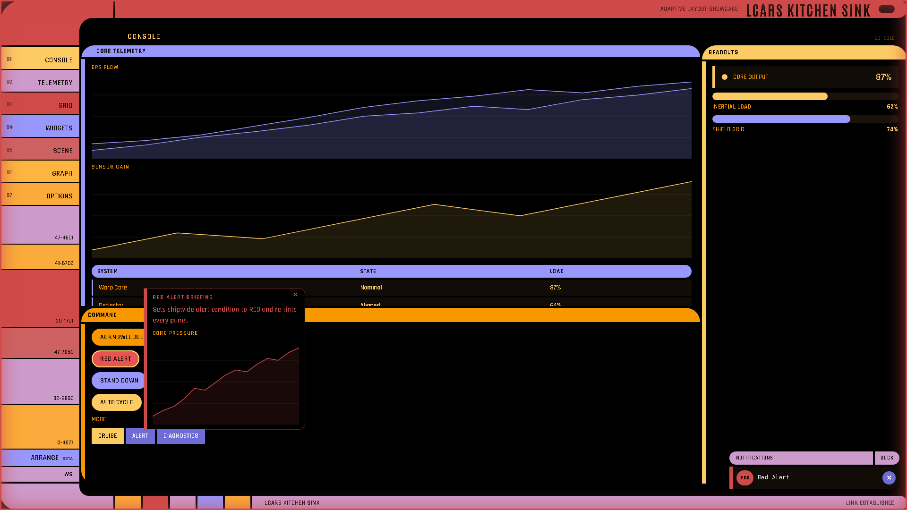
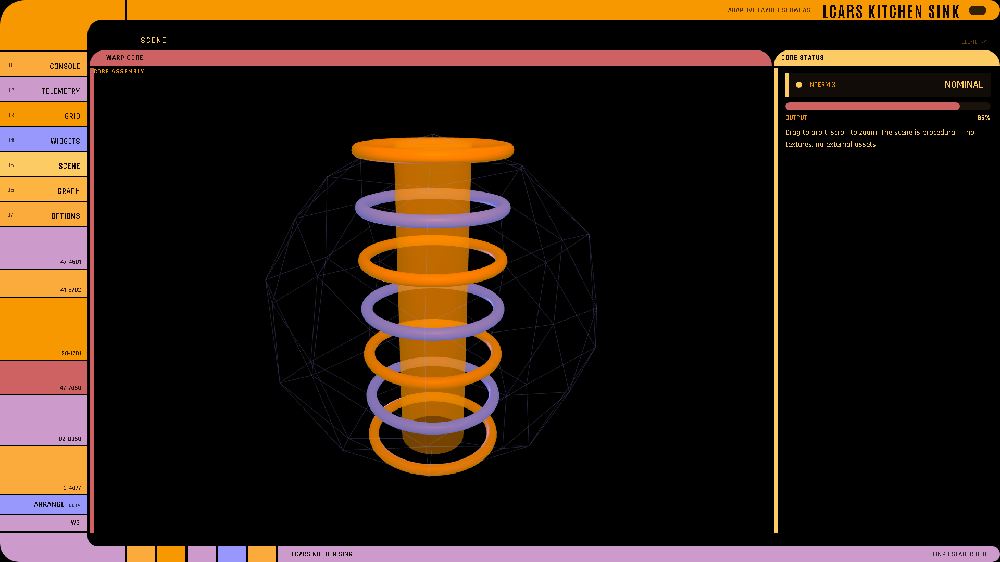
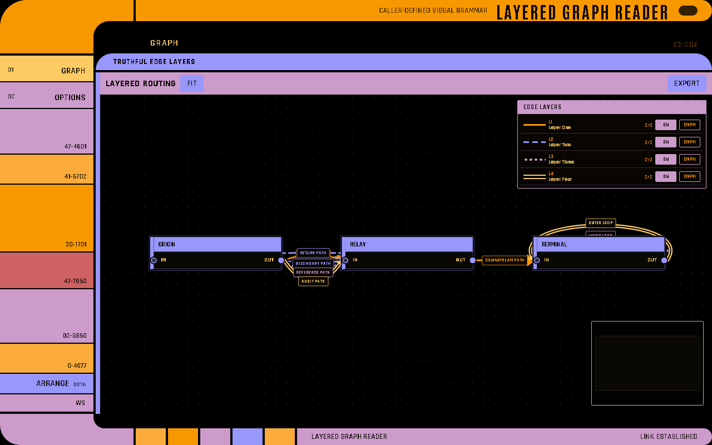
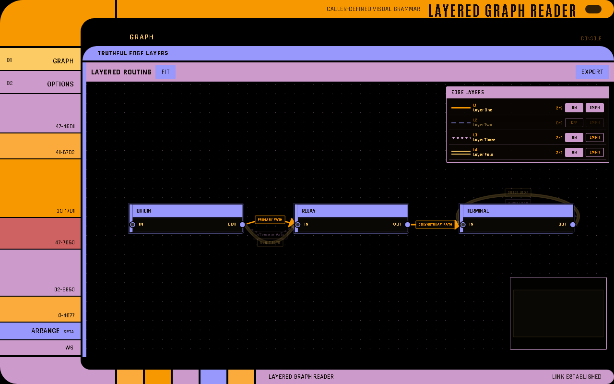
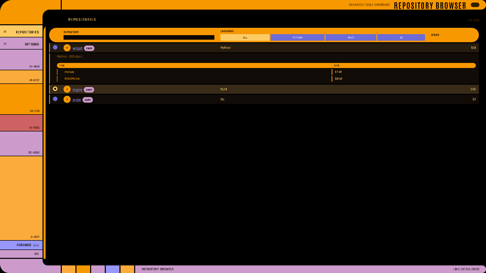
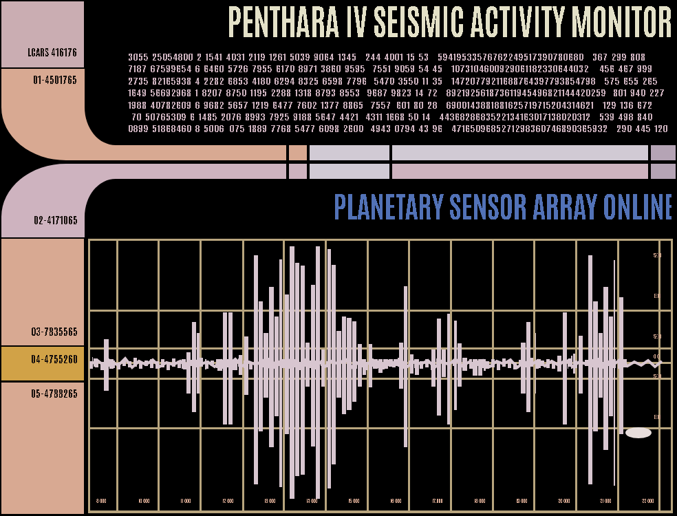

# Visual Gallery

Screenshots generated from live code-rendered LCARS-WebUI examples. All images are
captured from running apps — no static mockups or design tools.

The application surfaces themselves are code-rendered geometry and content. These
documentation captures are examples only; they are not embedded as UI backdrops.

## Console Archetype

Primary data lane (left), side readouts (right), control dock (bottom).


## Core Widget Gallery

A broad widget set rendered across a single page. Newer interactive surfaces are listed
below and are best inspected live.


## Display Widget States

`metric` status variants (`ok` / `warn` / `crit`), `alert` severity bands, `progress` fill levels.


## Input Widgets

Initial state:


Active / interacted state:


## Data Readouts

Gauge, sparkline, and metric readouts on a side rail.


## Telemetry Archetype

Dominant data scope filling the primary zone with a readout rail.


## Layout Containers

The LCARS-native containers: `data_panel`, `control_panel`, `box`, `sweep`.


## Sweep Container

`lcars.sweep` with header rail, column inputs, and bilateral content lanes.


## PADD Container

`lcars.padd` for detail and form views in the menu archetype.


## Diagnostic Container

`lcars.diagnostic` with main and side zones for paired data and control views.


## Knowledge-graph instruments

The dedicated example preserves the semantic distinctions carried by versioned
knowledge-graph payloads across all eight instruments.

| Evidence: support, frontier, assertion, anchor | Limits: tri-state, constraints, gaps, commitments |
| --- | --- |
|  |  |

## Typed v4 capabilities

| Data display and interaction state | Controls, validation, and container state |
| --- | --- |
|  |  |

## Rich interaction states

These captures intentionally exercise browser interaction rather than showing only the
initial manifest.

| Click hint, red alert, and notification | Movable pop-up, file upload, and notifications |
| --- | --- |
|  |  |

## Spatial workspaces

| Managed Three.js scene | Editable typed node canvas |
| --- | --- |
|  |  |

### Layered graph reader

The version-2 reader draws four caller-defined edge treatments, including parallel,
reciprocal, and nested self-loop routing. The second capture hides one layer and
emphasizes another; the underlying graph document is unchanged.

| All declared layers | Reader-local filter and emphasis |
| --- | --- |
|  |  |

### Graph proposal workspace

The generic workspace keeps the loaded canonical revision locked while proposal records,
typed values, edge fans, navigation state, diff, and submission remain inspectable.

| Canonical and proposal planes | Draft authoring and structural diff |
| --- | --- |
|  |  |

## Enhanced table

The repository browser combines typed columns, client-side sorting/filtering, selection,
and lazy expanded content.



## Surface Engine recreation

The measured Pentharan seismic monitor is rendered at 984×750 from Surface paths, rectangles,
an ellipse, and positioned text regions. Reference material is used only for offline measurement;
the running page receives no raster asset or image URL.



## Run the examples

```bash
cd lcars-ui
python examples/widget_capabilities/app.py
python examples/table_repositories/app.py
python examples/kitchen_sink/app.py
python examples/knowledge_graph/app.py
python examples/layered_graph/app.py
python examples/graph_workspace/app.py
python examples/canon_recreation/app.py
python examples/surface_recreation/app.py
```

The kitchen sink's **Scene** and **Graph** pages contain the managed Three.js scene and
editable node canvas. The layered-graph example is the focused read-only version-2
reader. The kitchen sink's **Widgets** page contains the hint, pop-up, upload,
microphone, and notification demonstrations.

## Rebuild this gallery

From `lcars-ui/`, build the bundled frontend and run the deterministic Playwright capture:

```bash
make frontend-bundle
make docs-screenshots
```

The capture uses 1920×1080 Chromium for README images and the established 1280×800
viewport for this Wiki gallery, always with reduced motion. Set `LCARS_CHROMIUM_PATH`
when Chromium is not at `/usr/bin/chromium`; set `PYTHON` to choose another interpreter.

---

**See Also:** [Layouts](Layouts) · [Widgets](Widgets) · [Build a Dashboard](Build-a-Dashboard)
