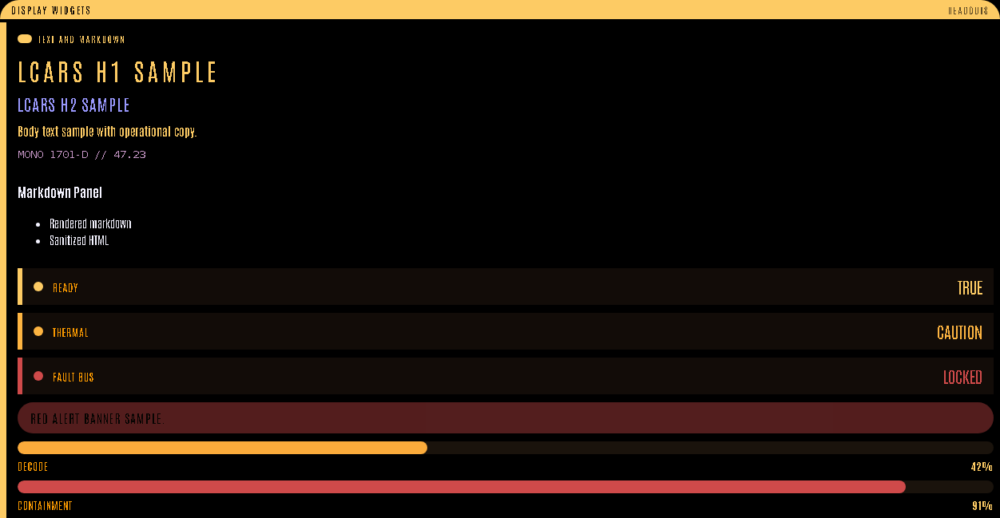
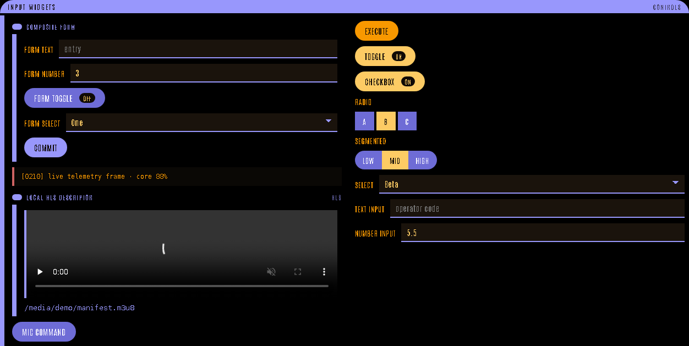
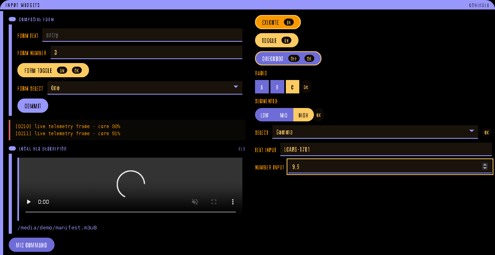
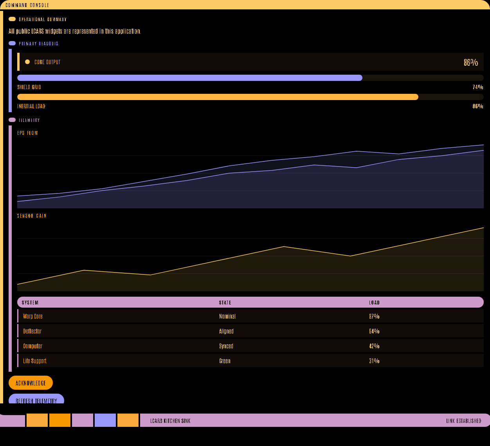
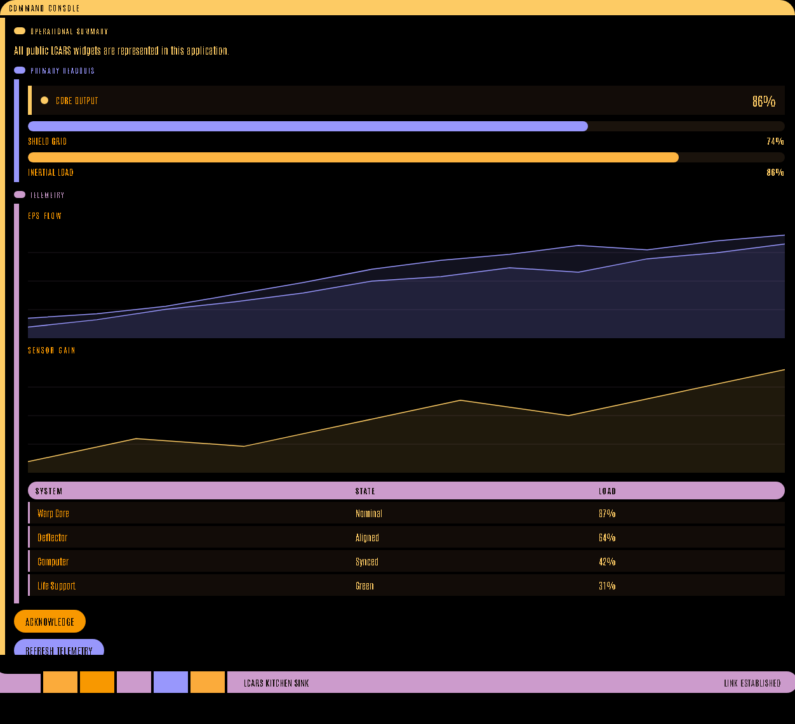

# Widget Gallery

The kitchen sink app renders the supported widget set in strict LCARS visual language.

## Display States

This panel shows text sizes, markdown, metric states, alert severity, progress, and gauge threshold styling.

## Input States

Initial state:

Active state after button, toggle, checkbox, radio, segmented radio, select, text, and number input changes:

## Data Readouts

## Telemetry

